---

title: Agent开发
description: 🥧Agent学习之路开启
image: 'https://img.f3f3.top/img/1786551490276_image.webp'#文章封面页
tags:
  - Agent所有知识
category: Agent 
  #永久连接id
abbrlink: "7777841"
# 文章置顶
pinned: true #文章置顶
published: 2026-07-18 18:19:03
updated: 2026-07-20 10:43:03
---

## 认识Agent

一个Agent =

1. **大脑（LLM）**
1. **手脚（Tools / MCP）**
1. **记忆（Memory）**
1. **规划（Planning / Workflow）**

## LLM

**TransFormer=同时看所有词+同时计算词与词之间的关系+多层深入理解**

### Prompt Engineering

**不是写提示词，是写“接口协议**

为了控制LLM的输出！

重点：

- 结构化输出（JSON）
- Role + Task + Constraint
- 少即是多，因为你用越少的语言传递越多有效的信息，LLM推理结果就会更好

```
你是一个音乐分析助手
输入：一首歌
输出：
{
  "bpm": "",
  "情绪": "",
  "风格": "",
  "结构": ""
}
```

## OpenAi规范

```
import os
from openai import OpenAI

try:
    client = OpenAI(
        # 替换成你自己的ak
        api_key="<your key>",
        #写进client里和baseurl模型服务器地址
        #可以通header传递，key为Authorization Bearer+apikey
        
        base_url="https://dashscope.aliyuncs.com/compatible-mode/v1",
    )

    completion = client.chat.completions.create(
        
        model="qwen-plus",
        #Array[]
        messages=[
        #系统提示词
            {"role": "system", "content": "You are a helpful assistant."},
            #用户提示词
            {"role": "user", "content": "你是谁？"},
        ],
    )
    temperature=0.3,  # 降低随机性，提高准确性
    #temperature越大越不严谨
   
   #限制
    max_tokens=500
    
    #stream流式输出
    "stream"=false #流式输出，true流式输出
     
    print(completion.choices[0].message.content)
except Exception as e:
    print(f"错误信息：{e}")
```

| 字段      |           非流式输出            | 流式输出                      | 说明                                                         |
| --------- | :-----------------------------: | ----------------------------- | ------------------------------------------------------------ |
| `id`      |              `id`               | `id`                          | API 请求返回的唯一标识。流式输出中，每个 chunk 的 `id` 通常相同。 |
| `choices` |            `choices`            | `choices`                     | 候选结果列表。非流式中每一项通常包含 `message`；流式中每一项通常包含 `delta`。 |
| 文本内容  |  `choices[i].message.content`   | `choices[i].delta.content`    | 非流式返回模型生成的完整文本；流式返回当前 chunk 的增量文本，需要按顺序拼接。注意：`choices[i].message.content` 只用于非流式输出，流式输出对应的是 `choices[i].delta.content`，不是 `message.content`。 |
| 工具调用  | `choices[i].message.tool_calls` | `choices[i].delta.tool_calls` | 非流式返回完整的工具调用信息；流式返回增量的工具调用信息，函数名和参数可能分多次返回，需要累积拼接。 |

## 框架选型

### spring

通过https://start.spring.io/快速创建


```
<packaging>pom</packaging>
<modules>
    <module>demo-common</module>
    <module>demo-service</module>
    <module>demo-web</module>
</modules>
//分模块设计
```

```
<parent>
    <groupId>com.example</groupId>
    <artifactId>demo-parent</artifactId>
    <version>0.0.1-SNAPSHOT</version>
    <relativePath>../pom.xml</relativePath>
</parent>
```

| 能力            | LangChain4j         | Spring AI        | Spring AI Alibaba              |
| --------------- | ------------------- | ---------------- | ------------------------------ |
| 是否依赖 Spring | ❌ 可独立使用        | ✔️ 深度集成       | ✔️ 深度集成                     |
| Prompt 模板     | ✔️ Mustache 风格     | ✔️ 类似 Thymeleaf | ✔️ 继承 Spring AI               |
| 结构化输出      | ✔️ 强（JSON Schema） | ✔️ 基础支持       | ✔️ 增强版                       |
| RAG 支持        | ✔️ 全链路            | ✔️ 基础           | ✔️ 企业级增强                   |
| 智能体（Agent） | ✔️ 内置 ReAct 等     | ❌ 需手动实现     | ✔️ Graph + Multi-Agent          |
| 工作流编排      | ⚠️ 简单 Chain        | ❌ 无             | ✔️ Graph 引擎（核心优势）       |
| 阿里云集成      | ✔️ Qwen / DashScope  | ❌ 无官方支持     | ✔️ 深度集成（百炼、OSS、Nacos） |
| 生产可观测性    | ⚠️ 需自行集成        | ✔️ Micrometer     | ✔️ ARMS / SLS 原生              |

- **非 Spring 的纯Java项目项目**→ 选 **LangChain4j**
- **需要快速原型验证**，且熟悉 LangChain 概念 → 选 **LangChain4j**
- **已有 Spring Boot 项目，只需简单 LLM 调用或 RAG** → 选 **Spring AI**
- **构建企业级、多步骤、多角色协作的 AI 应用** → 选 **Spring AI Alibaba**
- **想用 Java 但又想要接近 Python LangChain 的体验** → **LangChain4j 是最佳选择**

### LangChain

构建翻译系统

```
uv init langchain_test
cd langchain_test
uv venv
source .venv/bin/activate
//添加依赖
uv add langserve fastapi langchain_openai sse_starlette uvicorn
```

```
from fastapi import FastAPI
from langchain_core.prompts import ChatPromptTemplate
from langchain_core.output_parsers import StrOutputParser
from langchain_openai import ChatOpenAI
from langserve import add_routes

OPENAI_API_KEY = "sk-ws-H.EHMYHYX.VeUc.MEUCIQDyLgMI5VSHAOyUHnbblT4muC2q2DhOXkCPY9OY_a9GCAIga6OiX6wD-bOZtgzy4iGErxOZiP4E_QPbJtUcEPGYYr4"
OPENAI_API_BASE = "https://dashscope.aliyuncs.com/compatible-mode/v1"

# 1. Create prompt template
system_template = "Translate the following into {language}:"
prompt_template = ChatPromptTemplate.from_messages([
    ('system', system_template),
    ('user', '{text}')
])

# 2. Create model
model = ChatOpenAI(
    model="deepseek-v3",
    api_key=OPENAI_API_KEY,
    base_url=OPENAI_API_BASE,
    temperature=0.7,
)

# 3. Create parser
parser = StrOutputParser()


# 4. Create chain
chain = prompt_template | model | parser


# 4. App definition
app = FastAPI(
  title="LangChain Server",
  version="1.0",
  description="A simple API server using LangChain's Runnable interfaces",
)


# 5. Adding chain route
add_routes(
    app,
    chain,
    path="/chain",
)

if __name__ == "__main__":
    import uvicorn

    uvicorn.run(app, host="localhost", port=8000)

```

```
uv run main.py
```

**Prompt Template（提示模板）**

```
from langchain_core.prompts import ChatPromptTemplate
Plain Text
```

- 使用了 `ChatPromptTemplate.from_messages()` 构建结构化的聊天提示。
- 支持系统消息（system）和用户消息（user）的组合，是 LangChain 中用于构造 LLM 输入的标准方式。
- 利用了 **模板变量**（如 `{language}` 和 `{text}`），实现动态内容注入。

**LLM 集成（通过 OpenAI 兼容接口）**

```
from langchain_openai import ChatOpenAI
Plain Text
```

我们通过**OpenAI 兼容模式**调用的是阿里云 DashScope 的 DeepSeek 模型

**设置了** `model="deepseek-v3"`、`api_key`、`base_url`、`temperature` 等参数。

**Output Parser（输出解析器）**

```
from langchain_core.output_parsers import StrOutputParser
```

- `StrOutputParser()` 将 LLM 的原始响应（通常是 `AIMessage` 对象）转换为纯字符串。
- 这是 LangChain 中处理模型输出的标准方式，便于后续使用或返回给客户端。

**Chain（链式调用）**

```
chain = prompt_template | model | parser
```

- 使用 **LCEL（LangChain Expression Language）** 语法（`|` 操作符）将组件串联成一个可执行的流水线。
- 这是一个典型的 **Runnable Chain**：输入 → 提示模板 → 模型调用 → 输出解析。

**LangServe 集成（部署为 API**

```
from langserve import add_routes
```

- `add_routes(app, chain, path="/chain")` 自动为你的 chain 生成 RESTful API（包括 `/chain/invoke`, `/chain/stream` 等端点）。
- 基于 FastAPI，支持异步、OpenAPI 文档、自动请求/响应验证。

## SpringAI

### 接入配置

**父依赖**

```
<parent>
		<groupId>org.springframework.boot</groupId>
		<artifactId>spring-boot-starter-parent</artifactId>
//指定springBoot版本
		<version>4.1.0</version>
		<relativePath/> <!-- lookup parent from repository -->
	</parent>
	<groupId>com.example</groupId>
	<artifactId>demo</artifactId>
	<version>0.0.1-SNAPSHOT</version>
	<packaging>pom</packaging>
	<name/>
	<description/>
	<url/>

	<modules>
		<module>mcp/sringai</module>
	</modules>

	<properties>
		<java.version>17</java.version>
		<spring.ai.alibaba.version>1.1.0.0</spring.ai.alibaba.version>
	</properties>


	<dependencyManagement>
		<dependencies>
			<dependency>
				<groupId>com.alibaba.cloud.ai</groupId>
				<artifactId>spring-ai-alibaba-bom</artifactId>
				<version>${spring.ai.alibaba.version}</version>
				<type>pom</type>
				<scope>import</scope>
			</dependency>
		</dependencies>
	</dependencyManagement>
```

**子依赖**

```
  <parent>
        <groupId>com.example</groupId>
        <artifactId>demo</artifactId>
        <version>0.0.1-SNAPSHOT</version>
        <relativePath>../../pom.xml</relativePath>
    </parent>

    <groupId>com.example</groupId>
    <artifactId>sringai</artifactId>
    <version>0.0.1-SNAPSHOT</version>

    <properties>
        <maven.compiler.source>17</maven.compiler.source>
        <maven.compiler.target>17</maven.compiler.target>
        <project.build.sourceEncoding>UTF-8</project.build.sourceEncoding>      <spring.ai.alibaba.version>1.1.0.0</spring.ai.alibaba.version>
    </properties>
 
<dependencies>
    <dependency>
        <groupId>org.springframework.boot</groupId>
        <artifactId>spring-boot-starter-web</artifactId>
    </dependency>
    //子模块添加
    <dependency>
        <groupId>com.alibaba.cloud.ai</groupId>
        <artifactId>spring-ai-alibaba-starter-dashscope</artifactId>
        <version>${spring.ai.alibaba.version}</version>
    </dependency>
</dependencies>
```

- **properties中spring.ai.alibaba.version的版本号**
- **<version>${spring.ai.alibaba.version}</version>**

```
spring:
  ai:
    dashscope:
      api-key: sk-ws-H.EHMYHYX.VeUc.MEUCIQDyLgMI5VSHAOyUHnbblT4muC2q2DhOXkCPY9OY_a9GCAIga6OiX6wD-bOZtgzy4iGErxOZiP4E_QPbJtUcEPGYYr4
```

### 概念

#### ChatModel

- **ChatModel就是专门和对话模型对接的一套接口。**
- **定义了与支持对话功能的语言模型交互的统一方式**
- **ChatModel接口继承了两个接口**
- **一个是Model、一个是StreamingChatModel。**
- **DashScopeChatModel，这是一个具体的ChatModel的实现**

**call方法**

```
@RestController
@RequestMapping("/model")
public class ChatModelController {

    @Autowired
    private DashScopeChatModel dashScopeChatModel;

    @RequestMapping("/call/string")
    public String callString(String message) {
        return dashScopeChatModel.call(message);
    }
```

**stream方法**

```
    @RequestMapping("/stream/string")
    public Flux<String> callStreamString(String message, HttpServletResponse response) {
        response.setCharacterEncoding("UTF-8");
        //防止变成乱码
        return dashScopeChatModel.stream(message);
    }
```

- **callString方法返回值是个Stream**
- **callStreamString返回值是个Flux<String>**
- **不管是call方法，还是stream，入参都是Prompt**

**Message**

- **系统设定（`SYSTEM`）**
- **用户输入（`USER`）**
- **模型回复（`ASSISTANT`）**
- **工具返回结果（`ToolResponse`）**

**ChatOptions**

- **模型名称**
- **温度（temperature）**
- **最大生成 token 数量**
- **Top-k、Top-p 采样策略**
- **其他厂商特有的参数（比如 OpenAI 的 `stop`、`frequency_penalty` 等）**

```
DashScopeChatOptions.builder().withModel("qwen-plus").build()
```

**ChatResponse**

**不管是call方法，还是stream，出参都是ChatResponse，只不过一个是Flux<ChatResponse>**

```
resp.getResult().getOutput().getText()
```

#### ChatClient

**基础功能**

- **定制和组装模型的输入（Prompt）**
- **格式化解析模型的输出（Structured Output）**
- **调整模型交互参数（ChatOptions）**

**高级功能**

- **聊天记忆（Chat Memory）**
- **工具/函数调用（Function Calling）**
- **RAG**

##### 初始化

```
@RestController
@RequestMapping("/client")
//对chatclient进行初始化
public class ChatClientController implements InitializingBean {

    @Autowired
    private ChatModel dashScopeChatModel;
    private ChatClient chatClient;
 @Override
    public void afterPropertiesSet() throws Exception {
        chatClient = ChatClient.builder(dashScopeChatModel)
                // 实现 Logger 的 Advisor
                .defaultAdvisors(
                        new SimpleLoggerAdvisor()
                )
                .defaultSystem("请用英文回答问题")
                // 设置 ChatClient 中 ChatModel 的 Options 参数
                .defaultOptions(DashScopeChatOptions.builder()
                                .temperature(0.7)
                                .build()
                )
                .build();
    }
}   
```


##### Defult

**ChatClient在初始化的时候，可以指定很多defalut的配置**


**如果重新指定了system，那么defaultSystem就会被覆盖。**

```
 @GetMapping("/recover")
    public Flux<String> recover(String message, HttpServletResponse response){
        response.setCharacterEncoding("UTF-8");
        return chatClient.prompt(message).system("请用中文回答").stream().content();
    }
```

**如果是在 Prompt 中设置的 SystemMessage，则会追加，而不是覆盖**(**记忆)**

```
//追加关系（记忆）
    @GetMapping("/plus")
    public Flux<String> plus(String message,HttpServletResponse response) {
        response.setCharacterEncoding("UTF-8");
        List<Message> messages = List.of(
                new SystemMessage("8加7等于多少"),
                new UserMessage("message")
        );
        return chatClient.prompt(new Prompt(messages)).stream().content();
    }
```

##### Tools

**模型需要会用工具才能帮我实现很多功能**


##### Advisors

Advisors 是一组拦截器或“切面”，用于在调用前后对 Prompt 或 Response 进行拦截、修改、增强或记录。

类似于 Spring AOP 的 Advisor，但用于 AI 请求/响应的处理链路。）

RAG、记忆等等功能，都需要借助Advisor来实现

### 提示词工程

#### 角色设定

**利用defaultSystem指定**

```
@RestController
@RequestMapping("/promt/engineer")
public class PromtEngineerController implements InitializingBean {
    @Autowired
    private ChatModel chatModel;
    private ChatClient chatClient;
@GetMapping("/role")
public String role(String message) {
    return chatClient.prompt(message).call().content();

}
    @Override
    public void afterPropertiesSet() throws Exception {
        chatClient=ChatClient.builder(chatModel)
                .defaultSystem("你是一个毒舌博主，说话很噎人，请根据用户问题，怼他")
                .build();
    }
}
```

#### few-shot

**覆盖系统提示词**

```
 @GetMapping("/shot")
    public String shot(String message) {
        return chatClient.prompt().system("""
                请你根据用户输入的问题做改写，主要有以下改写策略：
                1、改写其中的错别字。
                2、做内容精简，帮用户的一堆废话精简成简单的一句话
                可以参考以下实例：
                
                Input：ni好
                Output ：{"错别字改写":"你好","内容精简":""}
                
                Input：我今天心情不错，我想知道今天是什么天气才让我心情这么好的？
                Output ：{"错别字改写":"","内容精简":"今天是什么天气？"}
                                
                """).user(message).call().content();
    }

```

#### 指定输出格式

**修改prompt提示词**

```
@GetMapping("/promptsEngineer3")
public Flux<String> chat3(@RequestParam(value = "message") String message, HttpServletResponse response) {
    response.setCharacterEncoding("UTF-8");

    return chatClient.prompt("请生成包括书名、作者和类别的三本虚构的、非真实存在的中文书籍清单，并以 JSON 格式提供，其中包含以下键:book_id、title、author、genre。").system("你是一个富有创意的作家").user(message).stream().content();
}

```

#### 指定步骤

```
@GetMapping("/chat4")
public Flux<String> chat4(@RequestParam(value = "message") String message, HttpServletResponse response) {
    response.setCharacterEncoding("UTF-8");

    return chatClient.prompt("""
                执行以下操作：
                  step1-用一句话概括下面文本。
                  step 2-将摘要翻译成英语。
                  step 3-在英语摘要中列出每个人名。
                  step 4-输出一个 JSON 对象，其中包含以下键：english_summary，num_names。
            
                    请用换行符分隔您的答案。
            """).system("你是个ai").user(message).stream().content();
}
```


#### 思维链

```
@GetMapping("/chat5")
public Flux<String> chat5(@RequestParam(value = "message") String message, HttpServletResponse response) {
    response.setCharacterEncoding("UTF-8");

    return chatClient.prompt("""
                一个水果摊有5箱苹果，每箱重15公斤。今天卖掉了35公斤，还剩下多少公斤苹果？
            
                                请一步一步思考，并给出最终答案。
            """).system("你是个ai").user(message).stream().content();
}
```

### 流式输出

#### sseEmitter

SseEmitter是Spring 提供的类，用于实现服务器推送的流式输出。

- 通过 `SseEmitter.send()` 方法发送每个事件。
- 如果一切顺利，通过 `emitter.complete()` 通知客户端输出完成。
- 如果发生异常，可以通过 `emitter.completeWithError()` 将错误通知客户端。

```
@RestController
@RequestMapping("/stream/output")
public class SseEmitterController {
    @GetMapping("/sse/emitter")
    public SseEmitter sse() {
        SseEmitter emitter = new SseEmitter(60_000L); // 设置超时时间
      //创建虚拟线程
        Executors.newSingleThreadExecutor().submit(() -> {
            try {
                for (int i = 0; i < 10; i++) {
                    emitter.send("Message " + i);
                    Thread.sleep(1000);
                }
                emitter.complete();
            } catch (Exception ex) {
                emitter.completeWithError(ex);
            }
        });

        return emitter;
    }
}
```

#### StreamingResponseBody

- StreamingResponseBody 是一个函数式接口，其内部通过 OutputStream 将数据逐步写入响应流，用它可以实现非阻塞的异步流式传输。
- Spring 在处理该返回值时会延迟执行该函数，直到响应提交前才调用 writeTo(OutputStream) 方法。
- 每次写入后调用 flush() 强制刷新缓冲区，使客户端能实时接收内容。

```
@GetMapping("/sse/streaming")
public ResponseEntity<StreamingResponseBody> chat() {
    StreamingResponseBody body = outputStream -> {
        for (int i = 0; i < 10; i++) {
            String data = "data chunk " + i + "\n";
            outputStream.write(data.getBytes(StandardCharsets.UTF_8));
            outputStream.flush();
            try {
                Thread.sleep(500); // 模拟延迟
            } catch (InterruptedException e) {
                throw new RuntimeException(e);
            }
        }
    };

    return ResponseEntity.ok()
            .header(HttpHeaders.CONTENT_TYPE, MediaType.TEXT_EVENT_STREAM_VALUE)
            .body(body);
}
```

#### Flux

Spring WebFlux 是一种响应式web框架，使用 WebClient 和 Netty 等非阻塞 IO 技术进行高效数据传输，支持非阻塞I/O。

```
<dependency>
     <groupId>org.springframework.boot</groupId>
     <artifactId>spring-boot-starter-webflux</artifactId>
</dependency>
```

```
@GetMapping(value = "/sse/flux")
public Flux<String> fluxStream() {
    return Flux.interval(Duration.ofSeconds(1))//相隔时间
    		.take(100)
            .map(seq -> "Stream element - " + seq);
           
}
```

- **只保留前 n 个元素 —— 第 100 个（Message 99）之后的就丢弃不发了。**
- **满 n 个后发出完成信号（onComplete）—— 告诉下游"流结束了"，SSE 连接也随之关闭。**
- **自动取消上游订阅 —— Flux.interval 本质是个无限流，如果不用 take(100)，它会永远每秒发一条、永不停止。**
- **take 会在取满后自动取消 interval 的定时器，释放线程/定时器资源**
- **.map 是 Reactor 里的映射/转换操作符**
- **：把流里的每一个元素，一对一地转换成另一个元素。**

#### 实现原理

- **不管是ChatModel还是ChatClient，最终都是依赖reactor.core.publisher.Flux#deferContextual来实现的。**
- **响应式编程是一种典型的观察者模式，当有新的可用的数据到来时，`Publisher` 会对`Subscriber`进行通知，这种推动是响应式的关键。**

Reactor项目的主要组件为 `reactor-core`。Reactor引入了可组合的响应式类型，这些类型既实现了 `Publisher` 又提供了丰富的操作符：`Flux` 和 `Mono`。

- **Flux` 对象表示含有0..N个元素的响应式序列。**
- **`Mono` 对象表示单个值或为空（0..1）的结果。**

**Flux 是 Reactor 库中的一个发布者（Publisher）**，遵循 **Reactive Streams 规范**。

它代表一个**异步的、非阻塞的序列**，可以发射：

- **0 到多个数据项（`onNext`）**
- **一个可选的错误（`onError`）**
- **或一个完成信号（`onComplete`）**

### 提示词模板

- **本质上利用占位符书写用户提示词**
- **利用PromptTemplate对象传参**
- **调用create方法（Map.of("topic ",topic)）**

```
@GetMapping("/Stream1")
    public Flux<String> stream1(String topic, HttpServletResponse response){
        response.setCharacterEncoding("UTF-8");
        String template= """
                请为我推荐一些关于{topic}开源项目
                """;
      return chatClient.prompt(new  PromptTemplate(template).create(Map.of("topic",topic))).stream().content();
    }

```

```
@GetMapping("/promptsEngineer7")
public Flux<String> chat7(@RequestParam(value = "message") String message, HttpServletResponse response) {
    response.setCharacterEncoding("UTF-8");

    HashMap variables = new HashMap();
    variables.put("language", "Java");
    variables.put("topic", message);
    PromptTemplate promptTemplate = PromptTemplate.builder().template("请给我推荐几个关于{topic}的开源项目,要求是和编程语言{language}相关的。").variables(variables).build();

    return chatClient.prompt(promptTemplate.create(Map.of("topic", message))).system("你是一个专业的的github项目收集人员").stream().content();
}
```


**把提示词通过文件来管理，一般使用.st文件，可以在项目中定义一个目录，然后把所有提示词都放在这个目录下，**

**prompts/open-source-system-prompt.st文件内容**

```
请给我推荐几个关于{topic}的开源项目,要求是和编程语言{language}相关的。
```

```
  @GetMapping("/chat2")
    public Flux<String> chat2( String topic, HttpServletResponse response) {
        response.setCharacterEncoding("UTF-8");

        Map<String, Object> variables = new HashMap<>();
        variables.put("language", "Java");
        variables.put("topic", topic);
        PromptTemplate promptTemplate = PromptTemplate.builder().resource(systemText).variables(variables).build();
        return chatClient.prompt(promptTemplate.create()).system("你是一个专业的的github项目收集人员").stream().content();
    }
```

### 结构化输出

#### bean

**StructuredOutputConverter的接口有实现类BeanOutputConverter**


**BeanOutputConverter这个类中重写了一个getFormat方法**

**内容为一段提示词，把这段提示词加到我们的对话的后面，就能得到我们想要的JSON格式**

```
@Override
public String getFormat() {
    String template = """
            Your response should be in JSON format.
            Do not include any explanations, only provide a RFC8259 compliant JSON response following this format without deviation.
            Do not include markdown code blocks in your response.
            Remove the ```json markdown from the output.
            Here is the JSON Schema instance your output must adhere to:
            ```%s```
            """;
                return String.format(template, this.jsonSchema);
}
```

**提前告诉Converter我们都需要哪些字段。BeanOutputConverter通过他的名字就能看出来，他其实是可以把模型的结构化输出转成一个bean的，而bean的话我们是可以提前定义好他的参数名**

```
public record Book(@JsonPropertyDescription("书籍名称") String title,
                   @JsonPropertyDescription("作者") String author,
                   @JsonPropertyDescription("书籍介绍") String description,
                   @JsonPropertyDescription("价格") BigDecimal price) {

}
```

```
  @GetMapping("/bean")
    public Book bean(String format) {
        BeanOutputConverter<Book> beanOutputConverter = new BeanOutputConverter<>(Book.class);
        return chatClient.prompt(new PromptTemplate("你需要推荐一本书，请以{format}格式输出")
                .create(Map.of("format", beanOutputConverter.getFormat())))
                .system("你是一个专业的图书推荐人员")
                .call()
                .entity(beanOutputConverter);
    }
```

```
@GetMapping("/chat2")
public String chat2(HttpServletResponse response) {
    Book book = chatClient.prompt("请帮我推荐几本java相关的书").system("你是一个专业的图书推荐人员").call().entity(Book.class);
    return book.toString();
}
```

**BeanOutputConverter只能针对String做转换，Flux<String>是不支持的。必须完整结果才能转换成bean。**

**.call.content返回值为字符串，需要借助entity转为Bean**

**第一行是参数合法性检测，**

**第二行是new 一个 BeanOutputConverter**

- **BeanOutputConverter的构造函数依赖ParameterizedTypeReference创建的，**
- **直接用ParameterizedTypeReference.forType(clazz)来把一个任意Class转成BeanOutputConverter需要。**

**第三行是调用doSingleWithBeanOutputConverter方法**：

- **在 LLM 调用之前，Converter向提示中添加格式指令，为模型提供明确的指导，以生成所需的输出结构。（doGetObservableChatClientResponse方法中）**
- **在 LLM 调用之后，Converter将模型的输出文本转换为结构化类型的实例。（outputConverter.convert(stringResponse)）**

#### List

**StructuredOutputConverter的实现类，除了BeanOutputConverter之外，还有ListOutputConverter、MapOutputConverter**

```
List<Book> result = chatClient.prompt("请帮我推荐几本java相关的书")
.system("你是一个专业的图书推荐人员")
.call().entity(

new ParameterizedTypeReference<
//抽象类需要重写方法
List<Book>>() {
  });
```

```
Map<String, Object> book = chatClient.prompt("请给我推荐几本心理学有关的书，书的内容包括书名、作者、价格、上市时间等信息，以书名作为key，书的信息作为value")
        .call().entity(new MapOutputConverter());
```

- **不支持转成List<Bean>和Map<String,Bean>，只能转成List<String>和Map<String,Object>，**
- **最终转成的内容并不是我们想要的，比如我们要一个完成的book，他可能只输出了一个书名的List。**

- **利用java8中的stream()转为List后自己转为Map或者设置few-shot提示词**

### 对话记忆

#### Message List

```
@RestController
@RequestMapping("/ai/memory")
public class ChatMemoryController implements InitializingBean {

    @Autowired
    private DashScopeChatModel chatModel;

    private ChatClient chatClient;

    @GetMapping("/chat")
    public String chat() {

        List<Message> messages = new ArrayList<>();

        //第一轮对话
        messages.add(new SystemMessage("你是一个游戏设计师"));
        messages.add(new UserMessage("我想设计一个回合制游戏"));
        ChatResponse chatResponse = chatModel.call(new Prompt(messages));
        String content = chatResponse.getResult().getOutput().getText();
        System.out.println(content);
        System.out.println("======");

        messages.add(new AssistantMessage(content));

        //第二轮对话
        messages.add(new UserMessage("能帮我结合一些二次元的元素吗?"));
        chatResponse = chatModel.call(new Prompt(messages));
        content = chatResponse.getResult().getOutput().getText();
        System.out.println(content);
        System.out.println("======");

        messages.add(new AssistantMessage(content));

        //第三轮对话
        messages.add(new UserMessage("那如果主要是针对女性玩家的游戏呢?有什么需要改进的？"));
        chatResponse = chatModel.call(new Prompt(messages));
        content = chatResponse.getResult().getOutput().getText();
        System.out.println(content);
        System.out.println("======");

        return content;
    }

    @Override
    public void afterPropertiesSet() throws Exception {
        ChatMemory chatMemory = new InMemoryChatMemory();

        this.chatClient = ChatClient.builder(chatModel)
                // 实现 Logger 的 Advisor
                .defaultAdvisors(new MessageChatMemoryAdvisor(chatMemory))
                // 设置 ChatClient 中 ChatModel 的 Options 参数
                .defaultOptions(
                        DashScopeChatOptions.builder()
                                .withTopP(0.7)
                                .build()
                )
                .build();
    }
}

```

#### chatid

- **message list是要每一次都重新add进去，传给大模型**
- **对话的历史message，我们是在代码中有调用记录的。**
- **记忆的消息设置同一个chat_memory_conversation_id，同一个这样的id下的消息就可以识别出来，这样就能组装成上面的message list给到LLM。**

```
@Autowired
private ChatModel chatModel;

private ChatClient chatClient;

    @GetMapping("/chat1")
    public Flux<String> chat1(String message, String chatId, HttpServletResponse response) {
        response.setCharacterEncoding("UTF-8");

        return chatClient
                .prompt()
                .user(message)
                .advisors(spec -> spec.param(ChatMemory.CONVERSATION_ID, chatId))
                .stream().content();

    }
```

```
@Aut   
   
   
   
   @Override
    public void afterPropertiesSet() throws Exception {
     //   ChatMemory chatMemory = MessageWindowChatMemory.builder().maxMessages(10).build();

        this.chatClient = ChatClient.builder(chatModel)
                
                //利用builder 实现 ChatMemoryAdvisor 的 Advisor              .defaultAdvisors(MessageChatMemoryAdvisor.builder(chatMemory).build())
                
                // 设置 ChatClient 中 ChatModel 的 Options 参数
                .defaultOptions(
                        DashScopeChatOptions.builder()
                                .withTopP(0.7)
                                .build()
                )
                .build();
```

**MessageWindowChatMemory,** 

- **Spring AI 框架中窗口对话记忆实现。**
- **核心思想是：只保留最近发生的、一定数量的交互消息，当消息数量超过窗口大小时，会自动将最早的消息移除**。
- **ChatMemory的maxMessages，里面的message的最大记忆条数，包括了UserMessage、AssistantMessage等，并不是说只有用户的对话内容。**

**想要构造一个MessageWindowChatMemory，可以用ChatMemoryAdvisor，有两个具体的实现**：

- **MessageChatMemoryAdvisor：这个Advisor的主要功能是将用户提出的问题和模型的回答添加到历史记录(messages)中，从而实现上下文记忆的能力。**
- **PromptChatMemoryAdvisor：是MessageChatMemoryAdvisor的一个增强，在有些不支持messages参数的模型使用的时候，可以用这种，他是改写了systemPrompt，把每一轮的输入和输出都补充到这里面去了。**

#### ChatMemory

- **MessageWindowChatMemory不用自己new**
- **注入的是一个基于内存的对话记忆**

```
<!--    chatMemoy基于内存对话记忆-->
    <dependency>
        <groupId>org.springframework.ai</groupId>
        <artifactId>spring-ai-autoconfigure-model-chat-memory</artifactId>
        <version>1.1.0</version>
    </dependency>
```

```
ChatClient.builder(chatModel)        .defaultAdvisors(MessageChatMemoryAdvisor.builder(chatMemory).build())
```

- **用 `chatModel` 构建客户端**

- **把“记忆顾问”挂上去**

**`记忆顾问`是MessageChatMemoryAdvisor`**

它的身份可以理解为

- `ChatClient` 的一个 `Advisor`
- 负责在每次请求前，按 `chatId` 去 `ChatMemory` 里取历史消息
- 再把这些历史消息塞进本次 prompt
- 模型返回后，再把新消息写回记忆

```
.advisors(spec -> spec.param(ChatMemory.CONVERSATION_ID, chatId))
```

- **`chatId` 不是直接传给模型**
- **它是传给 `MessageChatMemoryAdvisor`**
- **这个 advisor 会用它去定位“这是谁的历史消息”**

```
// 伪代码
history = chatMemory.get(chatId);
prompt = history + 当前用户消息;
answer = model.generate(prompt);
chatMemory.save(chatId, 用户消息, answer);

请求 -> ChatClient -> MessageChatMemoryAdvisor -> ChatMemory -> ChatMemoryRepository -> 存储后端
```

#### 总结

##### 策略

**`ChatMemory`：记忆策略层，负责“保留哪些消息、何时裁剪”**

**MessageWindowChatMemory**

- **`MessageWindowChatMemory` 只管窗口策略，不管具体存储。**
- **它 `add()` 时会先从仓库读出当前会话消息，再把新消息合并、裁剪，最后整体 `saveAll()` 回去。**
- **所以“记忆”不是历史全量保存，而是当前上下文窗口。**

**它默认是一个基于内存的短期记忆实现，它维护最多指定最大大小（默认值：20 条消息）的消息窗口。** 

##### 存储

**`ChatMemoryRepository`：存储层，负责“把消息存哪、怎么取出来”**

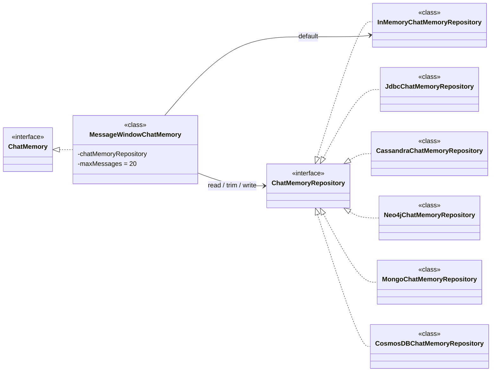

| 类/接口                         | 类型 | 关系                                                   | 职责                       | 典型特点                                         |
| ------------------------------- | ---- | ------------------------------------------------------ | -------------------------- | ------------------------------------------------ |
| `ChatMemory`                    | 接口 | 被 `MessageWindowChatMemory` 实现                      | 定义“聊天记忆”这一层抽象   | 负责记忆策略，不负责具体存储                     |
| `ChatMemoryRepository`          | 接口 | 被各类 Repository 实现                                 | 定义消息的存取能力         | 负责持久化/读取聊天消息                          |
| `MessageWindowChatMemory`       | 类   | `implements ChatMemory`，并依赖 `ChatMemoryRepository` | 按窗口大小维护上下文消息   | 默认最大 20 条；默认仓库是内存实现               |
| `InMemoryChatMemoryRepository`  | 类   | `implements ChatMemoryRepository`                      | 将消息存到本地内存         | 基于 `ConcurrentHashMap`；进程重启即丢失         |
| `JdbcChatMemoryRepository`      | 类   | `implements ChatMemoryRepository`                      | 将消息存到关系型数据库     | 支持 PostgreSQL / MySQL / SQL Server / Oracle 等 |
| `CassandraChatMemoryRepository` | 类   | `implements ChatMemoryRepository`                      | 将消息存到 Cassandra       | 适合高可用、TTL、分布式场景                      |
| `Neo4jChatMemoryRepository`     | 类   | `implements ChatMemoryRepository`                      | 将消息存到 Neo4j 图数据库  | 适合保留关系结构和图查询                         |
| `MongoChatMemoryRepository`     | 类   | `implements ChatMemoryRepository`                      | 将消息存到 MongoDB         | 面向文档存储，结构灵活                           |
| `CosmosDBChatMemoryRepository`  | 类   | `implements ChatMemoryRepository`                      | 将消息存到 Azure Cosmos DB | 外部模块，不属于 Spring AI 核心包                |

### 持久化记忆

#### 配置

**引入jdbc对话记忆仓库**

```
dependency>
    <groupId>org.springframework.ai</groupId>
    <artifactId>spring-ai-starter-model-chat-memory-repository-jdbc</artifactId>
    <version>1.1.0</version>
</dependency>
```


**一个是jdbc操作的工具包，一个是对他做自动化配置的。**

```
spring:
  application:
    name: demo
  ai:
    dashscope:
      api-key: sk-ws-H.EHMYHYX.VeUc.MEUCIQDyLgMI5VSHAOyUHnbblT4muC2q2DhOXkCPY9OY_a9GCAIga6OiX6wD-bOZtgzy4iGErxOZiP4E_QPbJtUcEPGYYr4
    chat:
        memory:
          repository:
            jdbc:
              platform: mysql
              initialize-schema: always
```

- **platform用于指定具体哪个数据库，他支持很多数据库**
- **在platform和schema二选一进行配置就行了，就是指定用哪个表结构**

```
CREATE TABLE `spring_ai_chat_memory` (
  `conversation_id` varchar(36) CHARACTER SET utf8mb4 NOT NULL,
  `content` text CHARACTER SET utf8mb4 NOT NULL,
  `type` enum('USER','ASSISTANT','SYSTEM','TOOL') CHARACTER SET utf8mb4 NOT NULL,
  `timestamp` timestamp NOT NULL DEFAULT CURRENT_TIMESTAMP ON UPDATE CURRENT_TIMESTAMP,
  KEY `SPRING_AI_CHAT_MEMORY_CONVERSATION_ID_TIMESTAMP_IDX` (`conversation_id`,`timestamp`)
) ENGINE=InnoDB DEFAULT CHARSET=utf8mb4 COLLATE=utf8mb4_general_ci
;
```

**数据库交互还需要一个datasource，我们需要有个数据库连接的能力，**

```
<dependency>
    <groupId>mysql</groupId>
    <artifactId>mysql-connector-java</artifactId>
    <version>8.0.33</version>
</dependency>
```

```
  datasource:
    url: jdbc:mysql://localhost:3306/springai?useUnicode=true&characterEncoding=UTF-8  # 记得改成你自己的
    username: root  # 记得改成你自己的
    password: 123456  # 记得改成你自己的
    driver-class-name: com.mysql.cj.jdbc.Driver
```

#### 引入仓库

```
@Configuration
public class JdbcChatMemoryConfiguration {

    @Bean
    public ChatMemory jdbcChatMemory(JdbcChatMemoryRepository jdbcChatMemoryRepository) {
        return MessageWindowChatMemory.builder().chatMemoryRepository(jdbcChatMemoryRepository).maxMessages(20).build();
    }
}

```

**cassandra和neo4j的支持可供选择**

```
<dependency>
    <groupId>org.springframework.ai</groupId>
    <artifactId>spring-ai-starter-model-chat-memory-repository-cassandra</artifactId>
</dependency>
```

```
<dependency>
    <groupId>org.springframework.ai</groupId>
    <artifactId>spring-ai-starter-model-chat-memory-repository-neo4j</artifactId>
</dependency>
```

### Advisor

#### 初识

**用于拦截、修改和增强 Spring 应用中的 AI 交互功能**

```
.defaultAdvisors(MessageChatMemoryAdvisor.builder(chatMemory).build())
```

```
.defaultAdvisors(
                        new SimpleLoggerAdvisor()
```


- **Advisor接口继承自Ordered，需要在实现`int getOrder();` 这个方法。**
- **这个方法主要是用来设置各个Advisor的顺序的。**

```
public interface Advisor extends Ordered {
    int DEFAULT_CHAT_MEMORY_PRECEDENCE_ORDER = -2147482648;
    String getName();
}
```


- **最基础的两个接口，一个是CallAdvisor一个是StreamAdvisor，**
- **一个是给同步调用使用的，另一个是给流式调用使用的**

- **提供了adviseCall和adviseStream方法**

**ChatClient 不是直接调某个 advisor，而是栈式递归**

**把所有注册到一个chatClient上的Advisor都找出来，然后按顺序执行**

**第一步**

- **DefaultChatClient` 负责把请求组装好，再启动链。**

- **`DefaultChatClient` 会把当前 chatClient 上注册的 advisor 按 `order` 组进 advisorChain**

**第二步**


- **然后同步走 nextCall()，流式走 nextStream()**
- **advisorChain.nextCall(chatClientRequest)**
- **advisorChain.nextStream(chatClientRequest)**

 **不是“调用一个 advisor”，而是“启动一整条责任链”，每个 advisor 都像 AOP 的一层织入，先进来的先包住请求，最后再包回响应**

**第三步**

- **ChatModelCallAdvisor / ChatModelStreamAdvisor`。链上的每个 advisor 都像 AOP 的一层环绕增强，**
- **`ChatModelCallAdvisor`：终点，真正调用 `chatModel.call(...)`，没有它链就断了**

**顺序**

- **order 越小，越先进入链**
- **越先进入的，越晚拿到响应**
- **order 越大，越靠近 ChatModelCallAdvisor 这个终点**

**分类**

- `SimpleLoggerAdvisor`：典型环绕型，前后都做日志，不改业务
- `SafeGuardAdvisor`：前置拦截 / 后置审查，必要时直接挡掉请求
- `BaseAdvisor`：模板层，把 `before / after` 这套样板封装掉，让具体 advisor 少写重复代码

#### ChatModel

**直接调用chatModel的call方法**


**理论上最后执行的，所以getOrder设置的是最低优先级。**

```
@Override
public int getOrder() {
    return Ordered.LOWEST_PRECEDENCE;
```

#### SimpleLogger


**adviseCall实现先记录一下request的日志，在调用之后，再记录一下response的日志。**

#### SafeGuard


**这是一个spring ai内置的安全审查的advisor，实现内容就是做敏感词拦截**：

#### Base

```
ChatClientRequest processedRequest = before(chatClientRequest, callAdvisorChain);

ChatClientResponse response = callAdvisorChain.nextCall(processedRequest);

return after(response, callAdvisorChain);
```

- **before()：模型调用前执行，相当于前置增强**
- **chain.nextCall()：继续执行后面的 advisor，直到最后调用模型**
- **after()：模型返回后执行，相当于后置增强**
- **如果某个 advisor 不调用 chain.nextCall()，就等于拦截请求，后面的 advisor 和模型都不会执行**

**Advisor 的“目标方法”不是某个 Service 方法，而是“后续 advisor + 最终 ChatModel 调用”**

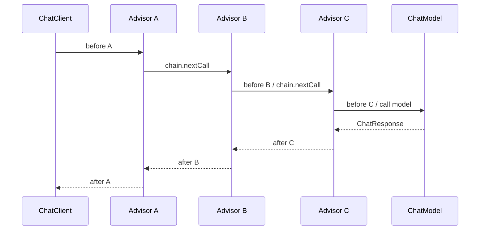

**`order` 越小，越早处理请求；但它越晚处理响应**

**MessageChatMemoryAdvisor 的 before**

```
用户这次的问题 + 历史对话记录
        ↓
组合成新的 Prompt
        ↓
再交给后面的 advisor / ChatModel
```

**模型并不是“自动记住上下文”，而是 `MessageChatMemoryAdvisor` 每次调用前主动把历史消息查出来，再塞到本次请求里。**

```
before 阶段：保存 user message
after 阶段：保存 assistant message
before：读取历史记忆 + 拼进本次请求 + 保存用户消息
after：提取模型回复 + 保存助手消息
```


- 用户传入 `Prompt`，Spring AI 先包装成 `ChatClientRequest`。  
- 请求进入 advisor 链，每个 advisor 可以检查、修改、增强请求。  
- 最终框架内置的模型调用 advisor 把请求发给 `ChatModel`。  
- `ChatModel` 返回 `ChatResponse`。  
- 响应再倒着穿过 advisor 链，每个 advisor 可以记录、修改或增强响应。  
- 最后 `ChatClientResponse` 被转换成用户拿到的 `content()`、`chatResponse()` 或实体对象

#### 本地模型

```
      <dependency>
            <groupId>org.springframework.ai</groupId>
            <artifactId>spring-ai-ollama</artifactId>
            <version>1.1.0</version>
        </dependency>
```

```
<dependency>
     <groupId>org.springframework.ai</groupId>
     <artifactId>spring-ai-autoconfigure-model-ollama</artifactId>
     <version>1.1.0</version>
 </dependency>
```

```
@Autowired
@Qualifier("ollamaChatModel")
private ChatModel ollamaChatModel;
```

```
@RestController
@RequestMapping("/ai/ollama")
public class OllamaChatController {

    @Autowired
    @Qualifier("ollamaChatModel")
    private ChatModel ollamaChatModel;

    @GetMapping("/stream/chat")
    public Flux<String> streamChat(HttpServletResponse response) {
        response.setCharacterEncoding("UTF-8");
        Flux<ChatResponse> stream = ollamaChatModel.stream(new Prompt("你是谁？"));
        return stream.map(resp -> resp.getResult().getOutput().getText());
    }
}
```

## LangChain4j

### 配置

**LangChain4j就是一个Java版的LangChain框架**

```
<dependency>
    <groupId>dev.langchain4j</groupId>
    <artifactId>langchain4j</artifactId>
    <version>1.8.0</version>
</dependency>

<dependency>
    <groupId>dev.langchain4j</groupId>
    <artifactId>langchain4j-open-ai-spring-boot-starter</artifactId>
    <version>1.8.0-beta15</version>
</dependency>
```

### 高层次

```
<dependency>
    <groupId>dev.langchain4j</groupId>
    <artifactId>langchain4j-spring-boot-starter</artifactId>
    <version>1.8.0-beta15</version>
</dependency>
```

### 普通对话

**只定义一个 Java 接口，LangChain4j 在运行时帮你生成实现类，内部自动完成“组装 Prompt、调用模型、解析结果、处理记忆、工具调用”等流程**

```
@AiService
public interface LangChainAiService {
    String chat(String userMessage);
}
```

- **@AiService 之后，它会被 Spring 扫描，并注册成一个 Bean**
- **被 @AiService标注的接口会自动创建实现类并注册到 Spring 容器中**

```
@Autowired
private LangChainAiService aiService;

@RequestMapping("/chat")
public String chat(HttpServletResponse response) {
    response.setCharacterEncoding("UTF-8");
    return aiService.chat("日本都有哪些美食？");
}
```

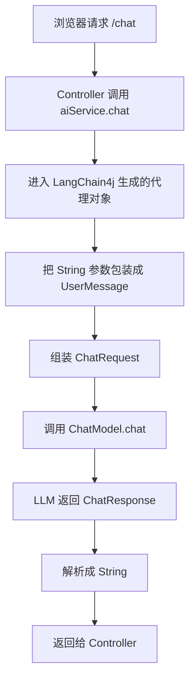

### 流式输出

```
<dependency>
    <groupId>dev.langchain4j</groupId>
    <artifactId>langchain4j-reactor</artifactId>
    <version>1.8.0-beta15</version>
</dependency>
```

```
@AiService
public interface LangChainAiService {
    Flux<String> chatStream(String userMessage);
}
```

```
@GetMapping(value = "/stream", produces = MediaType.TEXT_EVENT_STREAM_VALUE)
public Flux<String> stream(String msg) {
    return aiService.chatStream(msg);
}
```

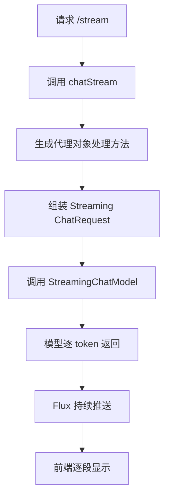

**普通 `String` 返回值是“等模型完整回答完再返回”，`Flux<String>` 是“模型生成一点就返回一点**

### 默认提示词

**用 @SystemMessage 和 @UserMessage`给接口方法加默认提示词**

```
@AiService
public interface LangChainAiService {

    @SystemMessage("你是一个毒舌博主，擅长怼人")
    @UserMessage("针对用户的内容：{{topic}}，先复述一遍他的问题，然后再回答")
    Flux<String> chatStream(String topic);
}
```

```
@UserMessage(fromResource = "your-prompt-template.txt")
String chat(String topic);
```

### 结构化输出

```
@AiService
public interface LangChainAiService {

    @UserMessage("请帮我推荐1本java相关的书")
    @SystemMessage("你是一个专业的图书推荐人员")
    Book getBooks();
}
```

```
@RequestMapping("/structure1")
public String structure1(HttpServletResponse response) {
    response.setCharacterEncoding("UTF-8");
    Book book = aiService.getBooks();
    return book.toString();
}
```

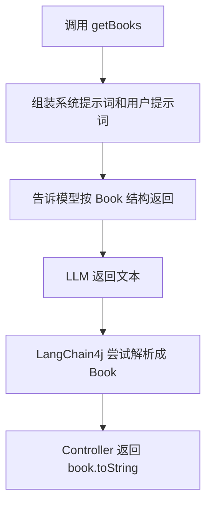

### 对话记忆

```
@AiService
public interface LangChainMemoryAiService {

    String chatMemory(@MemoryId String memoryId,
                      @UserMessage String userMessage);
}
```

- **如果用了 @MemoryId，就必须配置 `ChatMemoryProvider`**
- **chatMemoryProvider 根据不同 memoryId 提供不同的 ChatMemory 实例**

```
langChainMemoryAiService = AiServices.builder(LangChainMemoryAiService.class)
        .chatModel(chatModel)
        .streamingChatModel(streamingChatModel)
        .chatMemoryProvider(memoryId ->
                MessageWindowChatMemory.withMaxMessages(10)
        )
        .build();
```

```
@RestController
@RequestMapping("/langchain")
public class LangChainController implements InitializingBean {

    private LangChainMemoryAiService langChainMemoryAiService;

    @RequestMapping("/memoryChat")
    public String memoryChat(HttpServletResponse response,
                             String msg,
                             String memoryId) {
        response.setCharacterEncoding("UTF-8");
        return langChainMemoryAiService.chatMemory(memoryId, msg);
    }

    @Override
    public void afterPropertiesSet() {
        langChainMemoryAiService = AiServices.builder(LangChainMemoryAiService.class)
                .chatModel(chatModel)
                .streamingChatModel(streamingChatModel)
                .chatMemoryProvider(memoryId ->
                        MessageWindowChatMemory.withMaxMessages(10)
                )
                .build();
    }
}
```


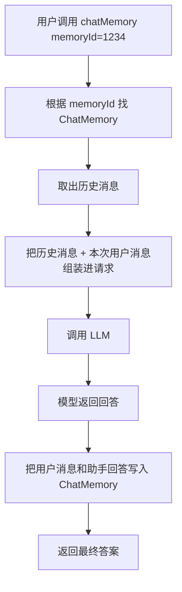

### 工具调用

**工具调用是让模型在回答前，先判断是否需要调用 Java 方法**

```
@RequestMapping("/toolCalling")
public String toolCalling(HttpServletResponse response, String msg) {
    response.setCharacterEncoding("UTF-8");

    LangChainAiService service = AiServices.builder(LangChainAiService.class)
            .tools(new TemperatureTools())
            .chatModel(chatModel)
            .build();

    return service.chat("2025年11月11日，杭州的气温怎样？");
}
```

```
public class TemperatureTools {

    @Tool("Get temperature by city and date")
    public String getTemperatureByCityAndDate(String city, String date) {
        System.out.println("getTemperatureByCityAndDate invoke...");
        return "23摄氏度";
    }
}
```

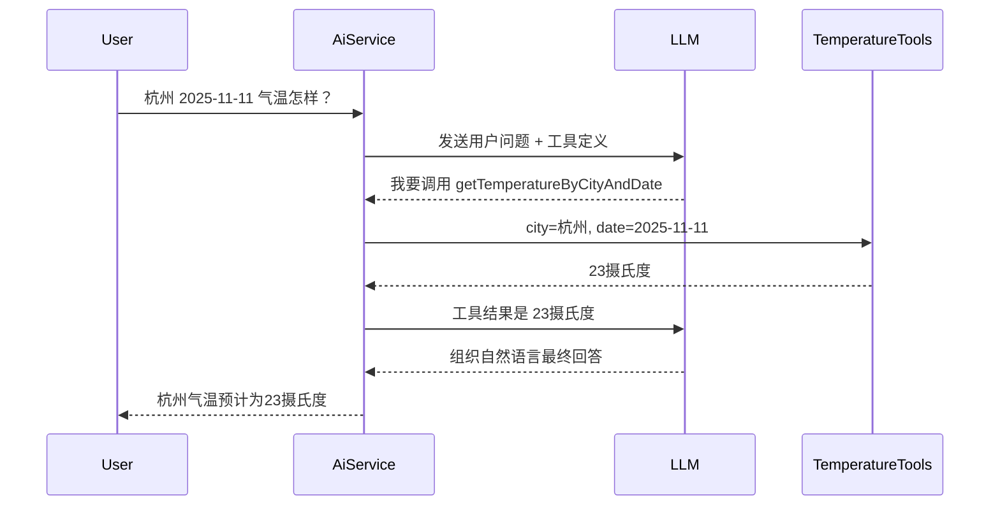

### 按需加载

```
ToolProvider toolProvider = request -> {
    if (request.userMessage().singleText().contains("booking")) {
        ToolSpecification toolSpecification = ToolSpecification.builder()
                .name("get_booking_details")
                .description("返回预订详情")
                .parameters(JsonObjectSchema.builder()
                        .addStringProperty("bookingNumber")
                        .build())
                .build();

        return ToolProviderResult.builder()
                .add(toolSpecification, toolExecutor)
                .build();
    }

    return null;
};
```

```
Assistant assistant = AiServices.builder(Assistant.class)
        .chatLanguageModel(model)
        .toolProvider(toolProvider)
        .build();
```

```
@AiService：把接口变成 Spring Bean
String 返回值：普通一次性回答
Flux<String> 返回值：流式回答，需要 langchain4j-reactor
@SystemMessage：系统提示词
@UserMessage：用户提示词或模板
POJO 返回值：结构化输出
@MemoryId + ChatMemoryProvider：多会话隔离记忆
.tools(...)：固定工具列表
.toolProvider(...)：按需动态加载工具
```

### @AIservice

- **启动时：把接口 Bean 替换成 AiServiceFactory**
- **创建时：AiServiceFactory 用 DefaultAiServices 生成 JDK 动态代理**
- **调用时：代理拦截接口方法，组装请求，最终调用 ChatModel 或 StreamingChatModel**

接口是没法直接实例化的。LangChain4j 把这个接口的 Spring Bean 定义替换掉

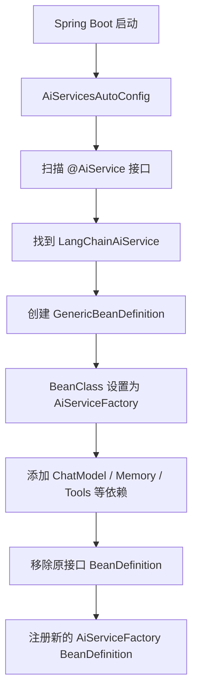

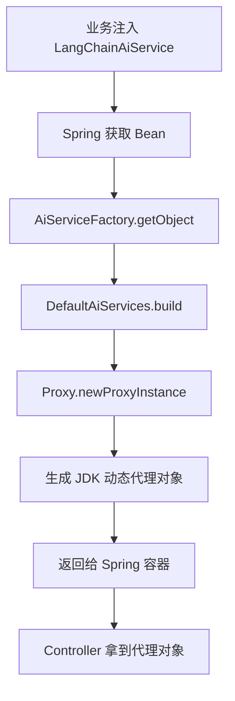

```
@AiService 方法调用
    ↓
JDK 动态代理 invoke
    ↓
解析方法签名和注解
    ↓
组装 ChatRequest
    ↓
ChatExecutor 执行
    ↓
ChatModel.chat
    ↓
返回 String / POJO / Flux
```

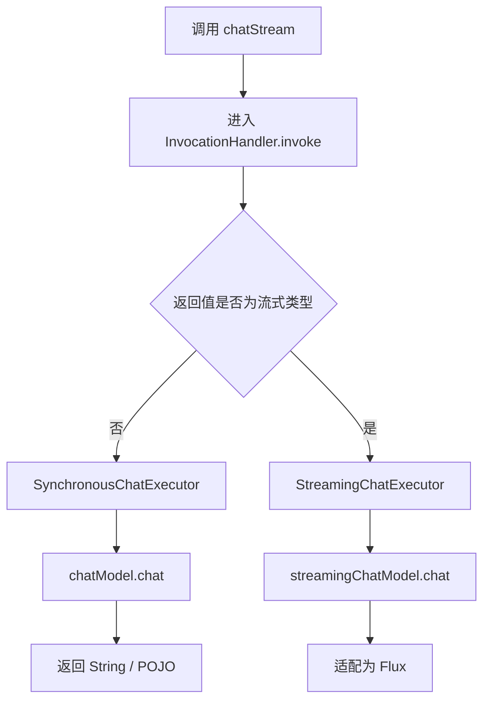


### 持久化记忆

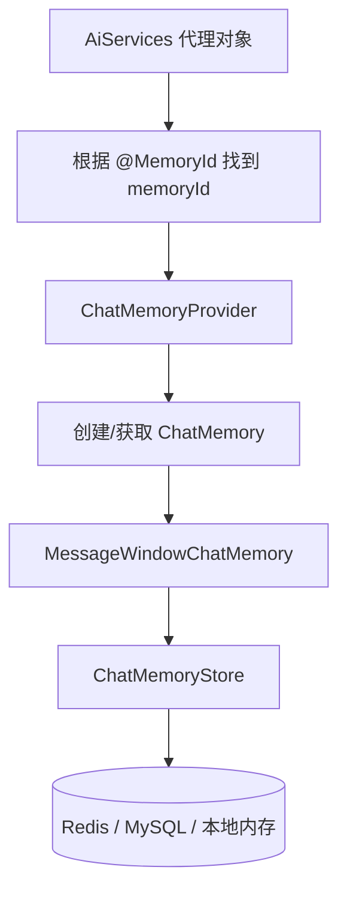

- **@MemoryId区分不同会话**
- **ChatMemoryProvider根据 memoryId 创建 ChatMemory**
- **MessageWindowChatMemory控制保留最近多少条消息**

- **ChatMemoryStore把消息保存到 Redis / MySQL**

```
@AiService
public interface LangChainMemoryAiService {

    String chatMemory(@MemoryId String memoryId,
                      @UserMessage String userMessage);
}
```

```
public interface ChatMemoryStore {

    List<ChatMessage> getMessages(Object memoryId);
    
    void updateMessages(Object memoryId, List<ChatMessage> messages);
//这里通常不是“追加一条”，而是“覆盖保存当前窗口内的全部消息
    void deleteMessages(Object memoryId);
   //清空上下文
}
```

```
@Component
public class RedisChatMemoryStore implements ChatMemoryStore {
    private final RedisTemplate<String, String> redisTemplate;

    public RedisChatMemoryStore(RedisTemplate<String, String> redisTemplate) {
        this.redisTemplate = redisTemplate;
    }

    @Override
    public List<ChatMessage> getMessages(Object memoryId) {
        String key = buildKey(memoryId);
        String json = redisTemplate.opsForValue().get(key);

        if (json == null || json.isEmpty()) {
            return Collections.emptyList();
        }

        return ChatMessageDeserializer.messagesFromJson(json);
    }

    @Override
    public void updateMessages(Object memoryId, List<ChatMessage> messages) {
        String key = buildKey(memoryId);
        String json = ChatMessageSerializer.messagesToJson(messages);
        redisTemplate.opsForValue().set(key, json);
    }

    @Override
    public void deleteMessages(Object memoryId) {
        redisTemplate.delete(buildKey(memoryId));
    }

    private String buildKey(Object memoryId) {
        return "langchain4j:chat-memory:" + memoryId;
    }
}
```

```
langChainMemoryAiService = AiServices.builder(LangChainMemoryAiService.class)
                .chatModel(chatModel)
                .chatMemoryProvider(memoryId -> MessageWindowChatMemory.builder().id(memoryId).maxMessages(10).chatMemoryStore(redisChatMemoryStore).build())
                .build();
```

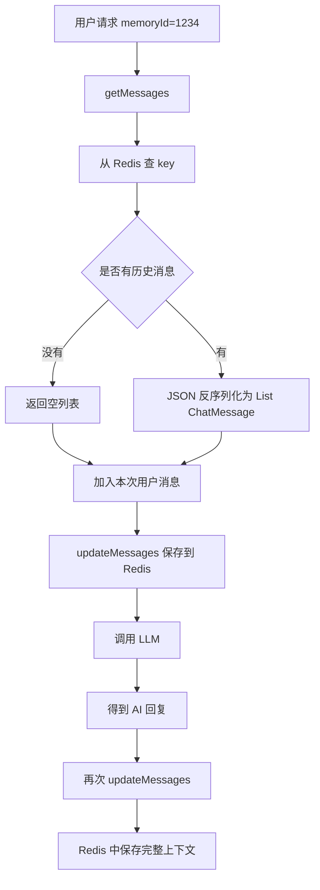

## Function Calling 

- **大模型自己其实不知道实时/外部数据**
- **Function Calling = 模型决定要调用哪个函数，并给出参数**

- **学会了发起函数调用请求**

- **真正执行的是你的程序或框架，比如 LangChain4j / Spring AI**


### 方法转成工具

```
@Configuration
public class FunctionCallConfiguration {
    @Bean
    @Description("根据用户输入的时区获取该时区的当前时间")
    public Function<TimeService.Request, TimeService.Response> getTimeFunction(TimeService timeService) {
        return timeService::getTimeByZoneId;
    }
}
```

Function的定义，他有两个泛型类型参数，分别是T和R

T表示这个function的入参，R表示出参

需要增加一个清晰的描述，讲清楚这个Function是干什么的，这样才能让模型更好的知道什么时候可以调用这个工具。

```
@Service
public class TimeService {
    public Response getTimeByZoneId(Request request) {
        System.out.println("getTimeByZoneId，zoneId=" + request.zoneId);
        ZoneId zid = ZoneId.of(request.zoneId);
        ZonedDateTime zonedDateTime = ZonedDateTime.now(zid);
        DateTimeFormatter formatter = DateTimeFormatter.ofPattern("yyyy-MM-dd HH:mm:ss z");
        return new Response(zonedDateTime.format(formatter));
    }


public record Request(
@JsonProperty(required = true, value="zoneId")
@JsonPropertyDescription("时区，比如 Asia/Shanghai") 
String zoneId) {}

    public record Response(String time) {
    }
}

```


```
@RestController
@RequestMapping("/function")
@Slf4j
@RequiredArgsConstructor
public class FunctionCallController {

    @Autowired
    private OpenAiChatModel chatModel;

    private ChatClient chatClient;

    @GetMapping("/chat")
    public String chat(@RequestParam("query") String query) {
        log.info("chat request => {}", query);

        return chatClient.prompt().toolNames("getTimeFunction").user(query).call().content();
//        return chatClient.prompt()
.tools(new TimeTools()).user(query).call().content();
    }

    @PostConstruct
    public void init() {
        ChatMemory chatMemory = MessageWindowChatMemory.builder().maxMessages(10).build();

        chatClient = ChatClient.builder(chatModel)
                .defaultAdvisors(MessageChatMemoryAdvisor.builder(chatMemory).build())
                .build();
    }
}
```

### 自定义工具

**定义一个工具给LLM用的话，可以直接借助@Tool 注解**

用@Tool把一个方法声明一个工具，用@ToolParam 来定义每个参数的描述。

```
public class TimeTools {
    @Tool(name = "getTimeByZoneId", description = "Get time by zone id")
    public String getTimeByZoneId(@ToolParam(description = "Time zone id, such as Asia/Shanghai") String zoneId) 
    {
        System.out.println("getTimeByZoneId，zoneId=" + zoneId);
        ZoneId zid = ZoneId.of(zoneId);
        ZonedDateTime zonedDateTime = ZonedDateTime.now(zid);
        DateTimeFormatter formatter = DateTimeFormatter.ofPattern("yyyy-MM-dd HH:mm:ss z");
        return zonedDateTime.format(formatter);
    }
}
```

- **方法转工具.toolNames("getTimeFunction")调用此方法**
- **自定义工具.tools(newTimeTools())调用用此方法**

### 自动执行

```
internalToolExecutionEnabled。
```

- **设置为false的话，Spring AI就不会自动调用，需要开发者自己控制工具的调用**
- **外部工具调用https://java2ai.com/docs/1.0.0.2/practices/integrations/tool-calling/**

### ToolCalling

**第一步**

**先把工具注册进去,chatClient.tools(...) 把工具对象交给 Spring AI**

```
this.toolCallbacks.addAll(Arrays.asList(ToolCallbacks.from(toolObjects)));
```

1. **把工具对象传给 `chatClient.tools(...)`**
1. **`ToolCallbacks.from(...)` 把它们转成一组 `ToolCallback`**
1. **Spring AI 后面统一按 `ToolCallback` 去执行**

**这不是把工具“交给模型”，而是注册给 Spring AI**

**第二步**

**Chat Request 里带上 Tool Definition(工具名,工具描述,入参 schema)**

- **AI Model 看见这些工具后，决定要不要调用**

- **是否要调用工具，并输出工具名和参数**；

**第三步**

**如果要调用，模型不会直接执行，而是返回一个 tool call**

- **例如：调用哪个工具**
- **参数是什么**

**Spring AI 再检查这个 response 里有没有 tool call,知道springai该调用谁**

**ToolCall[..., type=function, name=getTimeByZoneId, arguments={"zoneId":"Asia/Manila"}]**

```
toolExecutionResult = this.toolCallingManager.executeToolCalls(prompt, response);
```

**第四步**

**ToolCall交由 ToolCallingManager找到对应的 ToolCallback 执行工具**

**ToolCallback = 工具说明 + 工具执行器**

**ToolCallback 有两个实现(工具入口)**

**第一个**

**FunctionToolCallback**

**多个 `builder(...)`，说明它是把不同函数式对象包装成工具**

- **先把模型传来的 JSON 参数转成 Java 对象**
- **再直接调用函数**

**直接持有函数对象，执行时直接 `apply`**

**它不是反射，而是函数式回调**

**第二个**

**MethodToolCallback**

```
result = this.toolMethod.invoke(this.toolObject, methodArguments);
```

- **持有对象和方法,执行时 Method.invoke(...)**
- **`FunctionToolCallback` 走函数式回调，`MethodToolCallback` 走反射调用**
- **统一成 `ToolCallback`，所以调度方式是一致的**

**第五步**

**工具执行完，把结果交回给 AI Model**

**模型结合工具结果，生成最终 Chat Response**

## MCP

本质：

让Agent能接外部世界,**协议**就能实现一些api调用

比如：

- 查天气
- 调交易系统
- 调音乐生成服务


## RAG

### RAG出现原由

**让agent拥有你想要的知识**

**LLM的问题**：

- **不知道你私有数据**

- **容易幻觉**

- **无法实时更新**

- **LLM的知识停留在训练时刻，无法回答私有领域问题。RAG通过检索外部知识库为LLM补充实时、精准的上下**
  **文，使其回答有据可依。**

### RAG流程

### 数据准备阶段


**RAG 的过程：** 把问题转成语义向量；

使用嵌入模型把每个文本片段转换成一组数字

- 在知识库中检索最相关的文档片段；

- 将这些片段拼进提示词（Prompt）；

- 模型基于这些真实资料生成答案。

完整的RAG应用流程主要包含两个阶段：

- 数据准备阶段：数据提取——>文本分割——>向量化
  （embedding）——>数据入库
- 应用阶段：用户提问——>数据检索（召回）——>注入Prompt
  ——>LLM生成答案

**数据召回**将问题也转换成向量，然后在向量数据库中找到语义最相关的若干文本片段。

**注入Prompt**检索到的资料与用户问题一起交给大语言模型


#### **数据提取**

- 数据提取

- 数据加载：包括多格式数据加载、不同数据源获取等，根据数据自身情况，将数据处理为同一个范式。

- 数据处理：包括数据过滤、压缩、格式化等。

- 元数据获取：提取数据中关键信息，例如文件名、Title、时间等。

```
#示例：文档预处理代码
def preprocess_document(doc):
    # 1. 移除多余的空格和换行
    doc = re.sub(r'\s+', ' ', doc)
    # 2. 提取纯文本（从PDF、HTML等）
    if doc_type == 'pdf':
        text = extract_text_from_pdf(doc)
    # 3. 规范化格式
    text = text.strip().lower()
    # 4. 去除无用信息（页眉、页脚等）
    text = remove_headers_footers(text)
    return text
```

#### **文本分割**

**Chunking**

是把长文档切成多个较小文本块，方便后续进行向量化、检索和生成答案。

主要需要平衡两个因素：

1. **Embedding 模型的 Token 限制**
   嵌入模型一次只能处理有限数量的 Token。文档超过限制时，必须先切分。

1. **文本的语义完整性**
   每个文本块应尽量表达完整内容。切分位置不合理，会把相关信息拆散，降低检索结果的准确性。

- 句分割：以“句”的粒度进行切分，保留一个句子的完整语义。常见切分符包括：句号、感叹号、问号、换行符等。

- 固定长度分割：根据embedding模型的token长度限制，将文本分割为固定长度（例如256/512个tokens），这种切分方式会损失很多语义信息，一般通过在头尾增加一定冗余量来缓解。

- 段落

- **llm**拆分

```
#每300个字符一块
chunk_size = 300
chunks = [text[i:i+chunk_size] for i in range(0, len(text), chunk_size)]
```

```
#按句号、问号、感叹号分割
import nltk
sentences = nltk.sent_tokenize(text)
段落分块（保留逻辑结构）
#按换行符或段落标记分割
chunks = text.split('\n\n')
滑动窗口分块（带重叠，避免信息丢失）

chunk_size = 300
overlap = 50  # 重叠50字符
chunks = []
for i in range(0, len(text), chunk_size - overlap):
    chunks.append(text[i:i+chunk_size])
```

<details>
<summary>文本分割策略</summary>
**策略一：递归字符分割（Recursive Character Splitting）—— 通用首选**

这是 LangChain 默认且最推荐的分割器（`RecursiveCharacterTextSplitter`）。

- **原理**：它不是傻傻地按字数切，而是有一个优先级列表。

  a. 先尝试按 `\n\n`（段落）切。
  b. 如果切完还太大，就尝试按 `\n`（换行）切。
  c. 还大？按 `.`（句号）切。
  d. 最后才按字符切。

- **优点**：它极力保证了段落和句子的完整性，语义最连贯。

- **适用**：Word、TXT、PDF 提取后的纯文本。

**策略二：按结构分割（Structural Splitting）—— Markdown/代码神器**

如果你的原始文档格式很好（比如 Markdown 或代码），**千万不要**当成纯文本处理。

- **Markdown Header Splitter：**
  - 原理：根据 `# 标题1`、`## 标题2` 进行层级分割。
  - **神来之笔**：它会将标题作为**元数据（Metadata）**附带在每一个切片里。
  - 例子：
    - 切片内容：`“部署命令是 docker-compose up”`
    - 元数据：`{Header: "第三章：部署指南", SubHeader: "Linux环境"}`
  - **效果**：当 LLM 检索到这段话时，它知道这是属于“Linux部署”的，而不是“Windows部署”的，上下文极强。

**策略三：Small-to-Big（父子索引）—— 进阶大招**

这是目前提升 RAG 效果最有效的手段之一（LlamaIndex 中叫 `ParentDocumentRetriever`）。

- **痛点：**

  - 切片**太小**：含有语义信息少，LLM 看不懂上下文。
  - 切片**太大**：包含了太多噪音，向量检索不准（因为向量是取平均值的）。

- **解决方案：“存大找小”。**

  a. **切两刀：**

  - **小切片（Child Chunk）**：比如 128 Token。用来做 Embedding 和检索。
  - **大切片（Parent Chunk）**：比如 1024 Token（包含那个小切片）。

  b. **检索时**：用“小切片”去匹配用户的 Query（因为小切片语义聚焦，匹配最准）。

  c. **给 LLM 时**：找到小切片后，**把它的“父切片”（整段话）**扔给 LLM。

- **效果**：检索极其精准，同时 LLM 获得的上下文非常丰富。

用户问题****
   **↓**
**检索小切片**
   ↓
找到最匹配的子切片
   ↓
根据父子关系找到父切片
   ↓
把完整父切片交给 LLM

</details>

#### **向量化**

**embedding**

向量化是一个将文本数据转化为向量矩阵（一串数字）的过程，该过程会直接影响到后续检索的效果。

把文字转换成数字向量，相似的文字会得到相似的向量

**ChatGPT-Embedding**

ChatGPT-Embedding由OpenAI公司提供，以接口形式调用。

https://platform.openai.com/docs/guides/embeddings/what-are-embeddings

```
#使用OpenAI的Embedding模型
from openai import OpenAI
client = OpenAI()

text = "阿司匹林是一种解热镇痛药"
response = client.embeddings.create(
    model="text-embedding-3-small",
    input=text
)
vector = response.data[0].embedding
print(f"向量维度: {len(vector)}")  # 输出: 1536
print(f"前5个值: {vector[:5]}")    # 输出: [0.023, -0.014, 0.089, ...]
```

```
from sklearn.metrics.pairwise import cosine_similarity
import numpy as np

vec1 = np.array([0.1, 0.3, 0.5])
vec2 = np.array([0.12, 0.29, 0.51])
similarity = cosine_similarity([vec1], [vec2])[0][0]
print(f"相似度: {similarity:.3f}")  # 输出: 0.999（非常相似）
```

**ERNIE-Embedding V1**

ERNIE-Embedding V1由百度公司提供，依赖于文心大模型能力，以接口形式调用。

https://cloud.baidu.com/doc/WENXINWORKSHOP/s/alj562vvu

**M3E**

M3E是一款功能强大的开源Embedding模型，包含m3e-small、m3e-base、m3e-large等多个版本，支持微调和本地部署。

https://huggingface.co/moka-ai/m3e-base

**BGE**

BGE由北京智源人工智能研究院发布，同样是一款功能强大的开源Embedding模型，包含了支持中文和英文的多个版本，同样支持微调和本地部署。

https://huggingface.co/BAAI/bge-base-en-v1.5

**坑1：切片长度（Sequence Length）**

- 老模型限制：很多早期的模型（如 BERT，text2vec-base-chinese）只能处理 512 个 Token（约 300-400 个汉字）。
- 后果：如果你的文档切片是 800 字，后面的内容直接被模型截断丢弃了，根本搜索不到。
- 建议：务必选择支持 512 以上长度的模型。BGE-M3 和 OpenAI 都支持 8192，完全够用。

**坑2：指令前缀（Instruction Prefix）**

- 说法：有些模型（如 BGE）在生成向量时，需要加一个特定的前缀字符串。
  - 查询时：`"为这个句子生成表示以用于检索相关文章："` + 用户问题。
  - 入库时：不需要前缀。
- 后果：如果你代码里忘了加这个前缀，检索效果会断崖式下跌。
- 建议：仔细阅读 HuggingFace 模型页面的 Usage 说明。

**坑3：维度大小（Dimension）**

- 说法：维度越高，存储越贵，检索越慢，但理论上信息量越大。
  - OpenAI：1536 维或 3072 维。
  - BGE-large：1024 维。
  - M3E-base：768 维。
- 建议：对于百万级以下的数据量，768 维（base 版本）性价比最高，速度和精度的平衡点。不要盲目追求大维度。

**总结推荐**

- 无脑首选：BGE-M3（或者是 `bge-large-zh-v1.5`）。
  - 理由：中文最强，支持长文本，功能全，开源免费。
- 备选方案：M3E-base。
  - 理由：老牌稳定，特定领域可能更准，部署更轻量。
- 不要选：早期的 `text2vec` 系列（过时了），或者 OpenAI 的 `text-embedding-ada-002`（性价比低，效果一般）。

#### 数据入库

**为什么不用普通数据库？**

普通数据库（MySQL、MongoDB）擅长精确查询："找ID=123的记录"。但向量搜索是**相似性查询**："找和[0.1, 0.3, 0.5]最相似的10个向量"。

向量数据库用了特殊的索引算法（如HNSW、IVF），能在百万、千万级向量中毫秒级找到最相似的。

数据向量化后构建索引，并写入数据库的过程可以概述为数据入库过程，适用于RAG场景的数据库包括：FAISS、Chromadb、ES、milvus等。

1. **Pinecone**（云服务，简单好用）

```
import pinecone

pinecone.init(api_key="your-api-key")
index = pinecone.Index("my-rag-index")

#插入向量
index.upsert([
    ("doc1_chunk1", vector1, {"text": "阿司匹林是..."}),
    ("doc1_chunk2", vector2, {"text": "副作用包括..."})
])

#查询
results = index.query(query_vector, top_k=3)
```

**构建索引过程**

```
from langchain.text_splitter import RecursiveCharacterTextSplitter
from langchain.embeddings import OpenAIEmbeddings
from langchain.vectorstores import Pinecone
import pinecone

#1. 读取文档
with open("medical_docs.txt", "r") as f:
    document = f.read()

#2. 分块
text_splitter = RecursiveCharacterTextSplitter(
    chunk_size=500,
    chunk_overlap=50,
    separators=["\n\n", "\n", "。", "！", "？", "，"]
)
chunks = text_splitter.split_text(document)

#3. 初始化embedding模型
embeddings = OpenAIEmbeddings(model="text-embedding-3-small")

#4. 初始化向量数据库
pinecone.init(api_key="your-key")
index_name = "medical-rag"

#5. 创建索引并存储
vectorstore = Pinecone.from_texts(
    texts=chunks,
    embedding=embeddings,
    index_name=index_name
)

print(f"成功索引了 {len(chunks)} 个文本块！")
```

1. **Milvus**（开源，功能强大）

1. **FAISS**（Facebook开源，本地使用）

1. **Weaviate**（支持混合搜索）

### 应用阶段

#### 数据检索

常见的数据检索方法包括：相似性检索、全文检索等，根据检索效果，一般可以选择多种检索方式融合，提升召回率。

- **相似性检索**：即计算查询向量与所有存储向量的相似性得分，返回得分高的记录。常见的相似性计算方法包括：余弦相似性、欧氏距离、曼哈顿距离等。
- **全文检索**：全文检索是一种比较经典的检索方式，在数据存入时，通过关键词构建倒排索引；在检索时，通过关键词进行全文检索，找到对应的记录。

<details>
<summary>检索策略</summary>
**1. 相似性检索（Vector Similarity Search）**

这是 RAG 与传统搜索引擎最大的区别，也是让知识库具备“语义理解”能力的根本。

- **原理**：不再匹配字面上的词，而是匹配意思。
  - 用户搜：“我想退货”。
  - 文档里：“消费者享有7天无理由售后服务”。
  - 结果：传统检索（关键词）完全匹配不上，但**相似性检索**能匹配上，因为这两个句子的向量在多维空间里靠得很近。
- **距离算法选择：**
  - **余弦相似度（Cosine Similarity）：RAG 领域的绝对主流。**
    它衡量的是两个向量方向是否一致，对文本长度不敏感。
  - **欧氏距离（L2）**：衡量两点间的直线距离。通常用于图像检索，文本用得少。
  - **内积（IP, Inner Product）**：如果你已经把向量做了归一化（Normalized），内积计算最快，效果等同于余弦相似度。
- **工程陷阱：**
  - **语义漂移**：有时候“苹果公司”和“苹果手机”很近，但“苹果水果”也很近。纯向量检索容易被看起来相关但逻辑无关的词带偏。

**2. 全文检索（Full-Text Search / Keyword Search）**

这是老派技术（如 ElasticSearch、Lucene），但在 RAG 时代依然**不可或缺**。

- **原理**：基于**倒排索引（Inverted Index）**。
  - 它把文章拆成词（Token），建立“词 -> 文章ID”的索引。
  - 用户搜：“错误码 5003”。
  - 文档里：“...遇到 5003 报错...”。
  - 结果：**精准命中**。
- **为什么 RAG 还需要它？**
  - **专有名词/精确匹配**：向量检索对于**数字、型号、人名、缩写**非常不敏感（因为这些词在语义空间里很难定位）。比如搜“合同号 2023-A-01”，向量检索可能给你找来一堆“2023年的合同”，但不一定是 A-01。此时必须靠全文检索。
- **融合策略：混合检索（Hybrid Search）**
  - 这是目前**最高级**的玩法：
  - 同时并行跑两路检索：一路向量（查语义），一路全文（查关键词）。
  - 通过 **RRF（Reciprocal Rank Fusion）**算法把两路结果合并、去重、排序。
  - 结果：既懂语义，又能精确匹配关键词。

**3. BM25**

**4. 图检索**

</details>

**向量检索**

```
#用户问题
question = "阿司匹林有哪些副作用？"

#问题向量化
question_embedding = embeddings.embed_query(question)

#向量检索（找最相似的3个）
results = vectorstore.similarity_search_by_vector(
    embedding=question_embedding,
    k=3  # 返回top3
)

for i, doc in enumerate(results):
    print(f"结果{i+1}:")
    print(doc.page_content)
    print(f"相似度: {doc.metadata['score']}")
    print("-" * 50)
```

1. **单纯向量搜索**

- 优点：能理解语义
- 缺点：对专有名词、数字等不敏感

1. **混合搜索（Hybrid Search）**

- 向量搜索 + 关键词搜索

- 综合排序，取最优结果

```
#混合搜索示例
def hybrid_search(query, alpha=0.5):
    # alpha: 向量搜索权重（0-1）
    # 向量搜索结果
    vector_results = vectorstore.similarity_search(query, k=10)
    # 关键词搜索结果（BM25算法）
    keyword_results = bm25_search(query, k=10)
    # 融合排序
    final_results = merge_results(vector_results, keyword_results, alpha)
    return final_results[:3]  # 返回top3
```

**重排序（Re-ranking）**

初步检索后，用更精细的模型重新排序，提高精度。

```
from sentence_transformers import CrossEncoder

#加载重排序模型
reranker = CrossEncoder('cross-encoder/ms-marco-MiniLM-L-6-v2')

#对检索结果重新打分
query = "阿司匹林副作用"
candidate_docs = ["文档1内容", "文档2内容", "文档3内容"]

scores = reranker.predict([(query, doc) for doc in candidate_docs])

#按分数排序
ranked_docs = [doc for _, doc in sorted(zip(scores, candidate_docs), reverse=True)]
```

| 指标        | 含义                          | 公式                              |   目标   |
| ----------- | ----------------------------- | --------------------------------- | :------: |
| Recall@K    | 前K个结果中，包含多少相关文档 | 检索到的相关文档数 / 总相关文档数 | 越高越好 |
| Precision@K | 前K个结果中，有多少是相关的   | 相关文档数 / K                    | 越高越好 |
| MRR         | 第一个相关文档的排名倒数      | 1 / 第一个相关文档的排名          | 越高越好 |
| NDCG        | 考虑排序质量的综合指标        | 复杂公式                          | 越高越好 |

#### 提示词工程

在 RAG 场景下，提示词工程的目标只**有一个：强迫 LLM“忘记”它自带的训练知识，完全依赖你喂给它的“上下文”来回答问题（Grounding）。**

**标准 RAG 提示词架构：**

**一个优秀的 RAG Prompt 通常包含以下 4 个部分，顺序很重要：**

1. **角色设定（Role）：告诉 LLM 它是谁（专业的知识库助手）。**
1. **任务指令（Instruction）：核心规则（比如“只根据上下文回答”、“不要编造”）。**
1. **上下文数据（Context）：这是你检索到的那几段文字，通常用特殊符**号包裹。
1. **Json输出可以加一层校验可能引入{}**
1. **用户问题（Query）**：用户真正问的内容。
1. **结构化提示词**         **#角色     # 规则**
1. **Few-Short少量样本（几个示例）**
1. **提供上下文信息(RAG增强检索）**

```
结构化提示词

# Role

你是一个专业的企业知识库助手。你的任务是根据提供的【参考文档】回答用户的问题。

# Rules（关键！防幻觉指令）

1. 必须**仅依赖**下方的【参考文档】进行回答，不要使用你内部的训练知识。
2. 如果【参考文档】中没有包含回答问题所需的信息，请直接回答：“知识库中未找到相关信息”。
3. 回答需要逻辑清晰，分点表述。
4. 如果可能，请在回答的末尾注明引用的文档名称。

# Context（检索到的片段）

以下是参考文档片段：

<context>
{context_str}
</context>

# User Question

用户的问题是：
{query_str}

# Answer
请开始回答：


Few-Short少量样本
方法二：给予示例工程
示例1
示例2
```

```
messages=[
            {"role": "system", "content": "You are a helpful assistant."},
            {"role": "user", "content": "你是谁？"},
        ]
```

**系统提示词**

- **用户通常看不到或不能直接修改；但是做大模型应用开发的时候，代码里面是可以指定系统提示词的。**
- **在每次对话中隐式地作用于模型；**
- **是模型“默认行为”的基础**。

**用户提示词**

- **由用户自由输入；**
- **决定单次交互的具体内容方向**

````
# 角色定义
你是一名专业的旅行规划顾问，擅长根据用户偏好制定个性化的旅游计划。  
你需要以Markdown格式输出一份简洁、清晰、实用的行程安排。  
---
# 任务描述
根据用户输入的出行需求（如目的地、天数、兴趣点等），制定一个详细的旅行计划。  
要求内容包括：
1. 每日行程安排（含景点、交通、餐饮推荐）  
2. 总体花费预估（以人民币计）  
3. 温馨提示（如天气、穿衣建议、注意事项）
---
# 景点参考信息（上下文信息）
以下是部分城市旅游参考资料（供你在规划时参考）：
[文档片段1]
北京以历史文化景点为主，热门景点包括故宫、长城、颐和园。春秋季节气候宜人，适合户外活动。  

[文档片段2]
上海以现代都市景观与夜景闻名，热门景点包括外滩、迪士尼、豫园。地铁交通便利，美食多样。  

[文档片段3]
成都以美食和休闲文化著称，热门景点包括宽窄巷子、大熊猫基地、都江堰，节奏悠闲，消费亲民。
---
# 示例
## 示例1：
输入：我想去北京玩两天，主要想看名胜古迹。
输出：
```markdown
  # 北京两日游行程规划
  
  ## 第一天：历史文化探索
  - 上午：参观 **故宫**  
  - 下午：游览 **天安门广场**、**王府井步行街**  
  - 晚餐推荐：全聚德烤鸭  
  
  ## 第二天：自然与皇家园林
  - 上午：游览 **颐和园**  
  - 下午：前往 **八达岭长城**  
  - 晚餐推荐：老北京炸酱面  
  
  ### 预算预估
  约 ¥1200 / 人（含交通与餐饮）
  
  ### 温馨提示
  - 早晚温差较大，请带外套。  
  - 部分景区需提前预约。
```

## 示例2：
输入：帮我规划一个上海三天的亲子游。
输出：
```markdown
  # 上海三日亲子游计划
  
  ## 第一天：城市初体验
  - 上午：参观 **上海自然博物馆**  
  - 下午：漫步 **外滩**，夜游黄浦江  
  - 晚餐推荐：蟹粉小笼包  
  
  ## 第二天：迪士尼奇幻乐园
  - 全天游玩 **上海迪士尼乐园**  
  - 晚餐推荐：园区主题餐厅  
  
  ## 第三天：城市休闲与购物
  - 上午：游览 **豫园**  
  - 下午：南京路步行街自由活动  
  - 晚餐推荐：新天地西餐厅  
  
  ### 预算预估
  约 ¥2200 / 人（含门票与住宿）
  
  ### 温馨提示
  - 提前预约迪士尼门票。  
  - 夏季炎热，请携带防晒用品。
  ```

---

# 按照如下格式输出：
# <城市+天数>行程规划标题

## 第一天：
- 上午：
- 下午：
- 晚餐推荐：

## 第二天：
- 上午：
- 下午：
- 晚餐推荐：

## 第三天：
- 上午：
- 下午：
- 晚餐推荐：

### 预算预估
### 温馨提示

---

# 当前任务
请根据以下用户输入，生成Markdown格式的旅行行程方案：

用户输入：
“我打算去成都玩三天，想吃美食也想看看大熊猫。”
请确保按照指定的输出格式输出，不要输出多余解释或说明。
````

#### **优化**

**思维链（模型thking过程）一步一步完成**

- 首先输出一个**详细的、逻辑连贯的推理过程**，再基于这个过程得出结论。
- **指定每一个小问题，模型一个个回答**

**自我一致性(少数服从多数)**

- **并发调用**：**奇数次调用**大模型可**并行执行**，显著降低整体响应时间。
- **参数调节**：适当调整**tempature温度系数**或者**top-p**等模型超参，控制模型输出的多样性。条件允许的话，也可以使用不同的大模型，以增强推理路径的多样性。

```
如果孩子被别的小朋友校园霸凌了，要不要鼓励他勇敢打回去？ 

请从以下多个视角分别独立思考，并综合给出最终答案： 
//多次调用不同模型=>(汇总多个模型回答，分析)
1、孩子的父母 
2、育儿专家 
3、学校老师 
4、心理学家
5、孩子自身的角度
```

**思维树**

- **设计三种方案并分别评估优缺点**
- **最终拿到最好的结果**

```
[任务]设计订单到期关闭方案 

[步骤一]设计3种订单到期关闭的方案 
[步骤二]对每种方案评估他的优缺点 
[步骤三]综合3种方案，选择一个最优方案
```

**反思机制**

- 增加迭代环节：可以在答案修订和反思审查环节增加循环迭代，通过反复修订+审核，持续提升答案的精度。

 **生成 → 反思 → 修订 → 再反思 → 再修订 …... → 生成最终答案**

**ReAct**

它是一种结合**思考**（Reason）与**行动**（Act）的智能体框架

**先思考后行动，再观察结果后修正思考**。
**思考推理**

规划下一步、分解复杂任务或分析上一步行动的结果，生成具体的**执行计划**。延续了**思维链（CoT）**的优势，提供了动态推理和自主规划的能力。

**行动（工具调用）**

基于执行计划中每一步的指令要求，模型会自主选择并执行一个外部工具或 API（如联网查询、数学计算、代码生成、知识库查询等）。这也是大模型能够与外部世界建立连接的接口。

**观察 / 反馈**

反馈智能体成功获取到工具执行的结果后，将会根据原始问题和工具的执行结果，判断任务是否完成，如果未完成，则继续返回思考推理，生成下一步行动的结果，反复循环迭代。如果已完成，则直接进入总结阶段。

**输出总结**

当判断任务已完成时，它会整合整个循环过程中收集到的所有关键信息，生成一个全面、连贯的最终答案。

#### LLM生成

```

```

```
【任务描述】
假如你是一个专业的客服机器人，请参考【背景知识】，回
【背景知识】
{content} // 数据检索得到的相关文本
【问题】
石头扫地机器人P10的续航时间是多久？
```

- ***Prompt作为大模型的直接输入，是影响模型输出准确率的关键因素之一。***
- ***在RAG场景中，Prompt一般包括任务描述、背景知识（检索得到）、任务指令（一般是用户提问）***
- ***根据任务场景和大模型性能在Prompt中适当加入其他指令优化大模型的输出。***

RAG 并不是“给大模型接个数据库”这么简单，而是一套完整的信息检索与生成协同系统。Embedding 模型决定你“能不能找对东西”，检索策略决定你“会不会漏掉关键事实”，Prompt 工程决定模型“敢不敢胡说”，而最终的生成效果，往往是这些环节共同作用的结果。

在真实业务中，RAG 的性能瓶颈很少出现在大模型本身，更多出现在数据准备是否合理、切片是否科学、检索是否稳定、Prompt 是否约束到位。一旦其中某一环失控，模型再强，也只能在错误上下文里一本正经地胡说八道。

因此，一个可靠的 RAG 系统，核心目标只有三个：

**检索要准、上下文要真、模型要被约束。**

只要这三点成立，模型规模反而不是最重要的变量。

后续如果继续展开，可以分别从**分块策略优化、召回与重排序、多路检索融合、幻觉评估与监控**等角度，进一步把 RAG 从“能跑”推进到“能上线、能长期用”。

```
def rag_query(question):
    """完整的RAG查询流程"""
    # 1. 检索相关文档
    retrieved_docs = vectorstore.similarity_search(question, k=3)
    # 2. 构建prompt
    context = "\n\n".join([
        f"【文档{i+1}】{doc.page_content}"
        for i, doc in enumerate(retrieved_docs)
    ])
    prompt = f"""
    参考以下资料回答问题：
    {context}
    问题：{question}
    要求：
    1. 回答要准确、专业
    2. 必须基于参考资料
    3. 标注信息来源
    """
    # 3. 调用LLM生成
    response = client.chat.completions.create(
        model="gpt-4",
        messages=[{"role": "user", "content": prompt}],
        temperature=0.3
    )
    answer = response.choices[0].message.content
    # 4. 添加引用
    sources = [
        {"title": f"文档{i+1}", "score": doc.metadata.get('score', 0)}
        for i, doc in enumerate(retrieved_docs)
    ]
    return {
        "answer": answer,
        "sources": sources,
        "retrieved_docs": [doc.page_content for doc in retrieved_docs]
    }

#使用示例
result = rag_query("阿司匹林有哪些副作用？")
print("答案:", result['answer'])
print("\n参考来源:", result['sources'])
```

| 指标         | 评估内容               |       评估方法       |
| ------------ | ---------------------- | :------------------: |
| Faithfulness | 答案是否忠实于检索文档 |  LLM评判 / 人工标注  |
| Relevance    | 答案是否回答了问题     | LLM评判 / 相似度计算 |
| Coherence    | 答案是否流畅连贯       |    语言模型困惑度    |
| Groundedness | 答案是否有依据         |    检查是否有引用    |

### 动态TOPK算法

#### 认识

**固定 Top-K**

- Top-K 表示从知识库中取回得分最高的 K 个文本块。
- 每次检索固定K个候选
  优点简单，缺点灵活性差，无法应对负载变化或动态重要性

动态 Top-K 不是某一种固定算法，而是一套根据查询难度、检索分数和上下文预算动态决定召回数量的策略。

```
用户问题
  ↓
召回较多候选文档
  ↓
过滤、去重和重排序
  ↓
计算相关性得分
  ↓
动态阈值和分数断层判断
  ↓
Token 预算控制
  ↓
返回最终 K 个片段
```

#### 初始召回

向量数据库通常仍然要求传入一个固定的 K，因此可以先召回较多候选

```
向量召回 Top-30
→ 重排序 Top-20
→ 动态选择最终 0～10 个片段
```

初始召回数量可以根据系统状态调整：

- 高负载：适当减小候选数量；
- 系统空闲：增加候选数量，提高召回率；
- 查询复杂：扩大候选范围；
- 缓存命中：直接复用已有候选。

#### 评分与重排

候选片段可以根据以下信息评分：

- 向量相似度；

- BM25 关键词得分；

- Reranker 重排分数；

- 文档权威性和时效性；

- 来源优先级；

- 历史点击或命中率

```
向量检索或混合检索负责召回
→ Reranker 负责精确评分
```

动态截断最好依据 Reranker 分数，而不是未经校准的原始向量距离


### 多路召回设计

#### BM25

#### RANK


### 父子索引

### 优化选型

#### 总览

| 模块       | 解决的问题           | 主要优化手段                                 |
| ---------- | -------------------- | -------------------------------------------- |
| 知识工程   | 有没有正确知识       | 自动知识生产、语义切分、元数据补全、冲突治理 |
| Query 改写 | 用户问题能不能被搜到 | 主改写、子问题拆解、同义改写、改写模型微调   |
| 检索召回   | 能不能找回相关证据   | 向量检索、BM25、GraphRAG、标签加权、双路检索 |
| Rerank     | 正确证据能不能排前   | 多路结果融合、去重、重排序模型               |
| 截断策略   | 关键证据会不会被丢掉 | 证据压缩、8K token 截断、保留高价值片段      |
| 可信生成   | 模型会不会胡编       | 证据约束 RL、安全奖励、URL 校验              |
| 过程评测   | 错误发生在哪一环     | 10 阶段评测、badcase 归因、中间产物保存      |
| 反馈闭环   | 线上错误能不能修复   | 点踩回流、分诊 Agent、知识草稿、评测集回归   |

#### Query

##### Multi 

**核心思想**

**一个问题，多种问法。**

###### 工作流程

1. **输入原始问题**：用户问"Python如何处理JSON数据？"
1. LLM生成多个查询
1. ： 
   1. Query 1: "Python解析JSON的方法"
   1. Query 2: "如何在Python中读取JSON文件"
   1. Query 3: "Python JSON模块使用教程"
   1. Query 4: "Python处理JSON格式数据的最佳实践"
1. **并行检索**：用这4个查询同时去向量数据库检索
1. **结果合并**：把4次检索的结果去重、排序，得到最终结果

```
#伪代码示例
original_query = "如何提高代码执行效率？"

#LLM生成多个查询
multi_queries = llm.generate_queries(original_query, num_queries=4)
#输出：
#["代码性能优化技巧",
#"提升程序运行速度的方法",
#"如何让代码跑得更快",
#"代码执行效率优化最佳实践"]

#并行检索
all_results = []
for query in multi_queries:
    results = vector_db.search(query, top_k=5)
    all_results.extend(results)

#去重合并
final_results = deduplicate_and_rank(all_results)
```

##### RAG-Fusion

###### BRF

RAG-Fusion是Multi Query的**进化版**，不仅生成多个查询，还使用了**倒数排序融合（Reciprocal Rank Fusion, RRF）**算法来合并结果。

简单说：**不是简单粗暴地把结果堆一起，而是科学地给每个结果打分，让真正重要的文档排在前面。**

**RAG-Fusion工作流程**

1. **生成多个查询**（和Multi Query一样）
1. **并行检索**（和Multi Query一样）
1. **使用RRF算法融合结果**（这是关键！）
1. **返回重新排序后的Top-K文档**

```
def reciprocal_rank_fusion(search_results_dict, k=60):
    """
    使用倒数排序融合算法合并多个搜索结果
    Args:
        search_results_dict: {query: [(doc_id, score), ...]}
        k: RRF常数，默认60
    Returns:
        融合后的排序结果
    """
    fused_scores = {}
    for query, doc_scores in search_results_dict.items():
        for rank, (doc_id, score) in enumerate(doc_scores, start=1):
            if doc_id not in fused_scores:
                fused_scores[doc_id] = 0
            # RRF公式
            fused_scores[doc_id] += 1 / (k + rank)
    # 按融合分数降序排序
    reranked_results = sorted(
        fused_scores.items(),
        key=lambda x: x[1],
        reverse=True
    )
    return reranked_results

#使用示例
search_results = {
    "query1": [("doc1", 0.95), ("doc2", 0.88), ("doc3", 0.82)],
    "query2": [("doc2", 0.92), ("doc1", 0.87), ("doc4", 0.80)],
    "query3": [("doc3", 0.90), ("doc2", 0.85), ("doc1", 0.78)]
}

final_ranking = reciprocal_rank_fusion(search_results)
print(final_ranking)
#输出：[('doc2', 0.0486), ('doc1', 0.0479), ('doc3', 0.0320), ('doc4', 0.0161)]
```

假设我们要回答："Python异步编程的优势是什么？"

##### 区别

**普通Multi Query（简单合并）：**

- 结果包含很多重复文档
- 排序不一定科学
- Top-5可能都来自同一个查询

**RAG-Fusion（RRF融合）：**

- 去重且智能排序
- 综合考虑所有查询的反馈
- Top-5结果更多样化、更全面

**注意事项**

✅ **适用场景：**

- 用户问题比较复杂，需要多角度检索
- 对召回率要求高的场景
- 希望结果多样性的场景

❌ **不适用场景：**

- 简单的事实查询（浪费资源）
- 实时性要求极高的场景（会增加延迟）
- 资源受限的环境（多次LLM调用 + 多次检索）

#### 问题拆分

**核心思想**

**把一个复杂问题拆解成多个简单的子问题，逐个击破**

```
原始问题
    ↓
LLM分解为子问题
    ↓
并行检索每个子问题
    ↓
获得每个子问题的答案
    ↓
LLM综合所有子答案，生成最终回答
```

```
from langchain.llms import OpenAI
from langchain.prompts import PromptTemplate

#步骤1: 问题分解
decompose_prompt = PromptTemplate(
    template="""
    请将以下复杂问题分解为3-6个简单的子问题。
    每个子问题应该独立且可以单独回答。
    原始问题: {question}
    请以JSON列表格式输出子问题:
    ["子问题1", "子问题2", "子问题3", ...]
    """,
    input_variables=["question"]
)

llm = OpenAI(temperature=0.7)

original_question = "如何搭建一个高性能的RAG系统？需要考虑哪些技术选型和优化策略？"

#分解问题
sub_questions = llm(decompose_prompt.format(question=original_question))
sub_questions = json.loads(sub_questions)

#步骤2: 对每个子问题进行RAG检索和回答
sub_answers = []
for sub_q in sub_questions:
    # 检索相关文档
    relevant_docs = vector_db.search(sub_q, top_k=3)
    # 生成子答案
    answer_prompt = f"""
    基于以下文档，回答问题: {sub_q}
    文档内容:
    {relevant_docs}
    请简洁明确地回答:
    """
    sub_answer = llm(answer_prompt)
    sub_answers.append({
        "question": sub_q,
        "answer": sub_answer
    })

#步骤3: 综合所有子答案
synthesis_prompt = f"""
你是一个专业的技术专家。现在你需要基于以下子问题和对应的答案，
综合生成一个完整、有条理的回答。

原始问题: {original_question}

子问题和答案:
{json.dumps(sub_answers, ensure_ascii=False, indent=2)}

请生成一个结构清晰、逻辑连贯的最终答案:
"""

final_answer = llm(synthesis_prompt)
print(final_answer)
```

#### 问答转化

你在图书馆找书，直接冲过去问管理员："2023年10月发布的那个新的React框架叫什么？"管理员一脸懵逼。但如果你先退一步问："最近有哪些新的React框架？"然后再缩小范围

**Step Back Prompting就是这个道理**——不直接回答具体问题，而是先生成一个更抽象、更通用的"回退问题"，从更高层次理解用户意图，然后再回答原问题。

```
from langchain_openai import ChatOpenAI
from langchain_core.prompts import ChatPromptTemplate

#Step 1: 定义Step Back提示词模板
step_back_template = """你是一个世界知识专家。你的任务是把具体问题转化为更通用的回退问题。

示例：
原问题：特斯拉Model 3在2023年Q4的销量是多少？
回退问题：特斯拉Model 3历年的销量趋势和数据有哪些？

原问题：张三在2020-2022年担任什么职位？
回退问题：张三的职业生涯发展轨迹是怎样的？

现在请处理这个问题：
原问题：{original_question}
回退问题："""

llm = ChatOpenAI(model="gpt-4", temperature=0.3)
step_back_prompt = ChatPromptTemplate.from_template(step_back_template)

#Step 2: 生成回退问题
def generate_step_back_question(original_q):
    chain = step_back_prompt | llm
    response = chain.invoke({"original_question": original_q})
    return response.content

#Step 3: 使用回退问题进行RAG检索
from langchain.vectorstores import FAISS
from langchain.embeddings import OpenAIEmbeddings

def step_back_rag(original_question, vectorstore):
    # 生成回退问题
    step_back_q = generate_step_back_question(original_question)
    print(f"📝 回退问题: {step_back_q}")
    # 用回退问题检索
    docs = vectorstore.similarity_search(step_back_q, k=5)
    context = "\n\n".join([doc.page_content for doc in docs])
    # 最终回答
    final_prompt = f"""基于以下上下文信息，回答问题。
    
上下文：
{context}

回退问题：{step_back_q}
原问题：{original_question}

请给出准确、详细的回答："""
    response = llm.invoke(final_prompt)
    return response.content

#使用示例
question = "DeepSeek在2024年1月发布的模型性能如何？"
answer = step_back_rag(question, my_vectorstore)
print(f"✅ 答案: {answer}")
```

**适用场景**

✅ **非常适合：**

- 需要多步推理的复杂问题
- 时间序列相关查询（"最近"、"历年"、"趋势"）
- 需要理解高层概念的问题

❌ **不太适合：**

- 简单的事实查询（"北京是中国的首都吗？"）
- 需要实时数据的场景
- 计算密集型任务


### 混合检索


传统RAG只用向量检索(语义匹配），对关键词精确匹配效果差。本系统采用语义检索+关键词检索双路召回+
RRF 融合排序：

## Agent


## 长期记忆


## 工具

### Tool

Tool = API 的抽象,tool就是调用后端接口的能力：post，get

```
{
  "name": "get_hot_music",
  "description": "获取热榜音乐"
}
```


## Harness

**Agent = 模型 (Model) + Harness**

- 模型：负责思考、推理、决策
- Harness：负责**稳定、不崩、不跑偏、可持久、可恢复**


## Skill


## AgentScope


## 大模型微调

## 解决问题方式

### ReAct边想边做

#### 核心流程

**Thought → Action → Observation → Thought → … → 完成**

- **Thought（思考）**：分析当前状态，决定下一步
- **Action（行动）**：调用工具/API
- **Observation（观察）**：拿到返回结果，进入下一轮思考

#### 特点

- ✅ **动态自适应**：每一步都根据最新结果调整策略
- ✅ **适合不确定/探索性任务**：实时信息、多跳问答、环境多变
- ❌ **效率低、调用多**：走一步看一步，容易绕圈、目标漂移

### PlanAct先规划，后执行

#### 核心流程

**阶段1：Plan（规划）→ 阶段2：Execute（执行）**

- **Planner**：LLM 全局思考，输出完整步骤清单（Task List）
- **Executor**：按顺序逐条执行，中间一般不做大改
- （可选）**Replan**：失败时局部调整计划

#### 特点

- ✅ **稳定、高效、可控**：全局最优，步骤清晰，不易跑偏

- ✅ **适合结构化/长任务**：报告生成、数据分析、固定流程SOP

- ❌ **灵活性差**：前期规划错了，后面容易一路错到底

| 维度      | ReAct                    |   PlanAct（Plan-and-Execute）    |
| --------- | ------------------------ | :------------------------------: |
| 核心逻辑  | **边想边做，动态迭代**   |    **先全局规划，再顺序执行**    |
| 时序      | 思考与行动**交替**       | 先**一次性规划**，后**批量执行** |
| 灵活性    | 强（随时调整）           |        弱（计划定了难改）        |
| 稳定性    | 易漂移、绕圈             |           高、不易跑题           |
| 效率/成本 | 调用多、成本高           |          调用少、成本低          |
| 最佳场景  | 实时信息、探索、环境多变 |   流程固定、长任务、结构化工作   |

### 怎么选

- **不确定、要实时反馈、探索型 → ReAct**

- **确定流程、长任务、要稳定高效 → PlanAct**

- **工程常用混合：外层 Plan，内层 ReAct**（大任务拆解，子任务动态处理）

## 多agent

### 分层结构

```
Controller Agent（大脑）
   ↓
Task Agent（拆任务）
   ↓
Executor Agent（执行）
```

###  协作模式

- 父子（调度）

- 平行（协同）

- 竞争（投票）

### 核心难点

####  状态管理

保存什么？”是灵魂问题

业界主流：

- 当前任务状态
- 中间结果
- 工具调用记录
- LLM推理结果（可选）

#### 快照 & 恢复

场景：

- 任务中断
- Agent崩溃
- 超时

#### 记忆系统

##### 纵向演进

- 存储：**上下文窗口 → RAG / 向量库 → 分层 / 图谱 / 层级 → 三维统一架构**。
- 能力：**被动记录 → 检索 → 抽象 / 反思 → 自我演化 / 持续学习**。
- 范式：**静态 LLM → 带记忆 Agent → 自适应 / 成长型智能体**。

分三层：

- 短期记忆（上下文）

- 长期记忆（向量库）

- 用户画像（偏好)

### 安全机制

“三层防护”：

1. 权限控制
1. 操作确认（Human-in-the-loop）
1. 沙箱执行（隔离环境）
